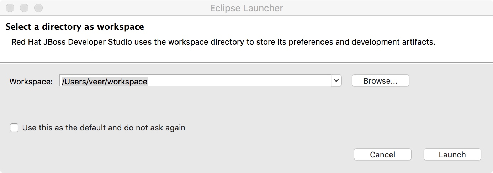
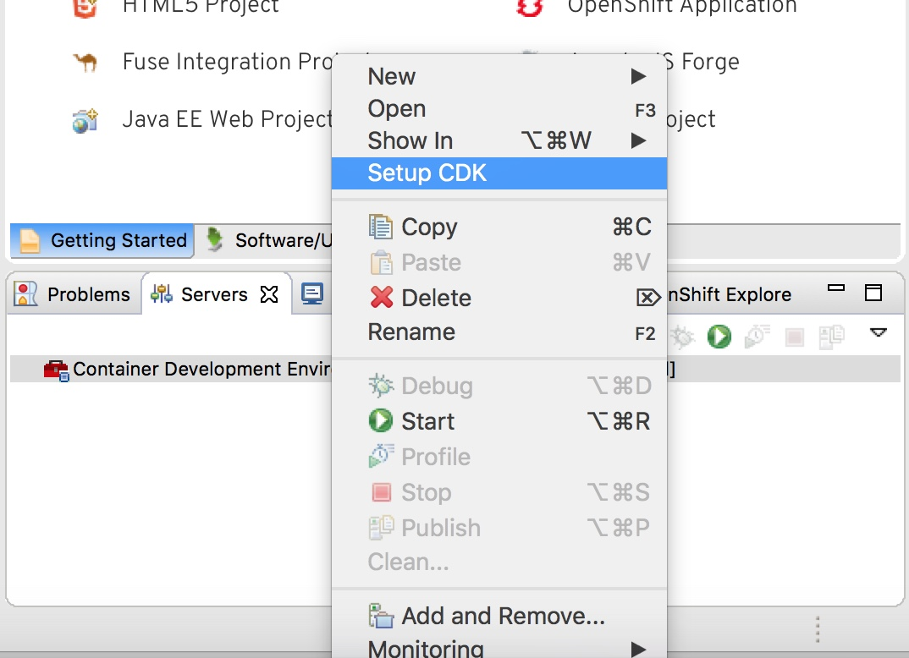
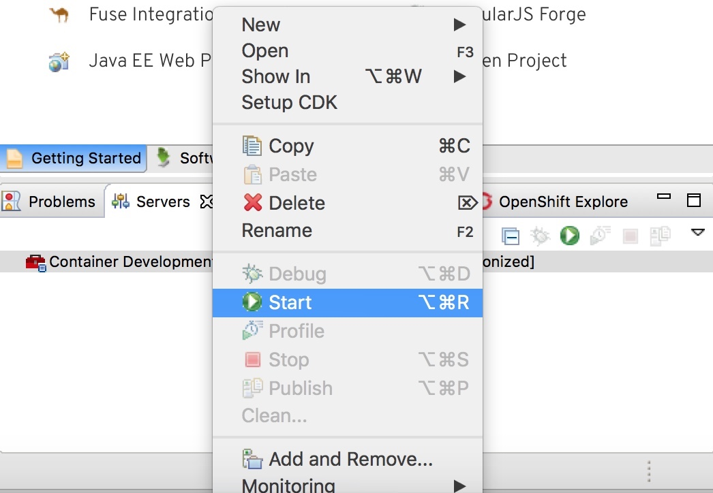
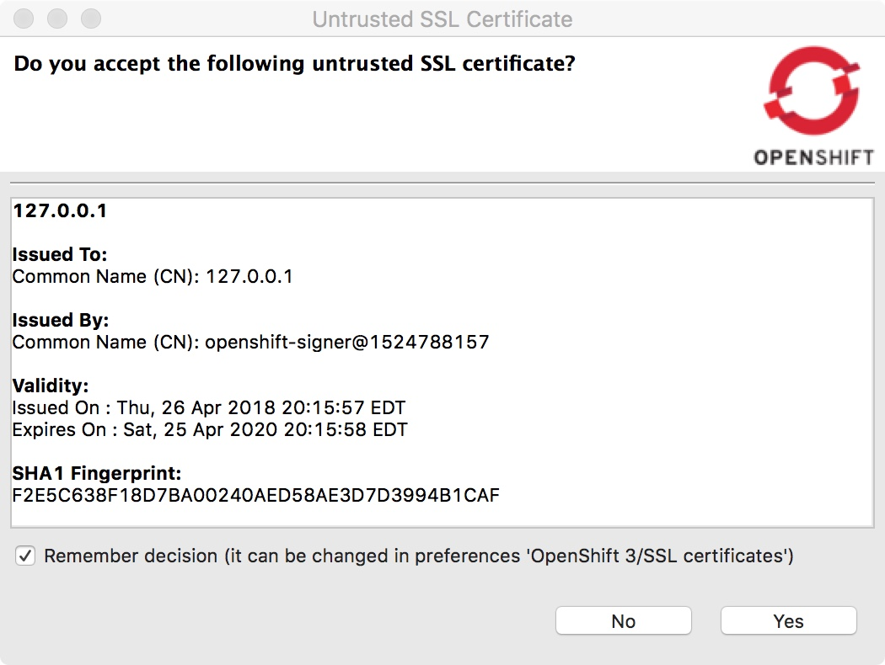
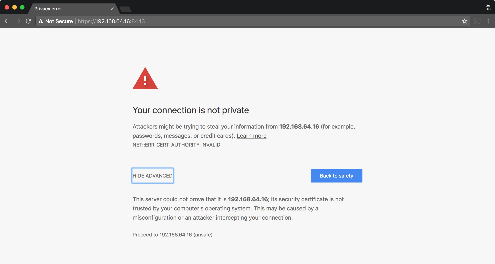
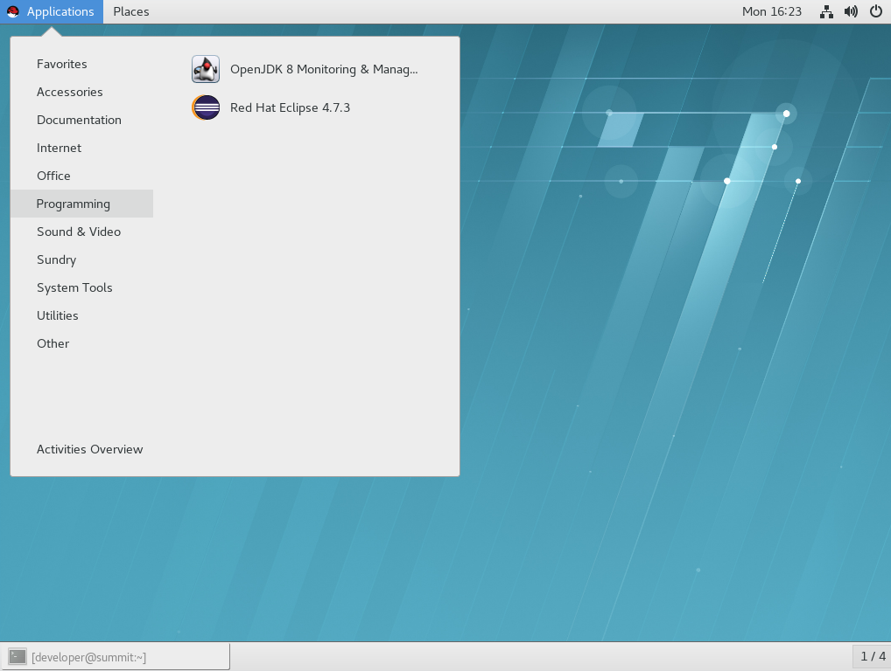
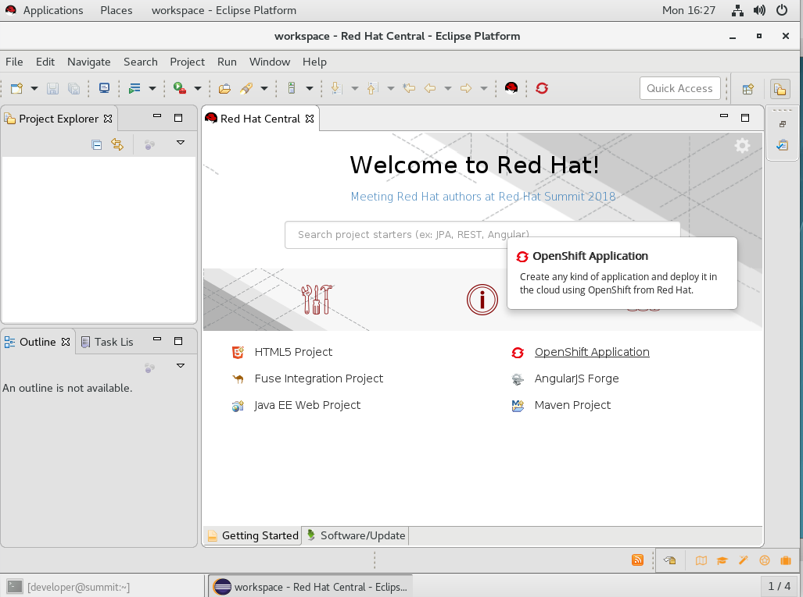
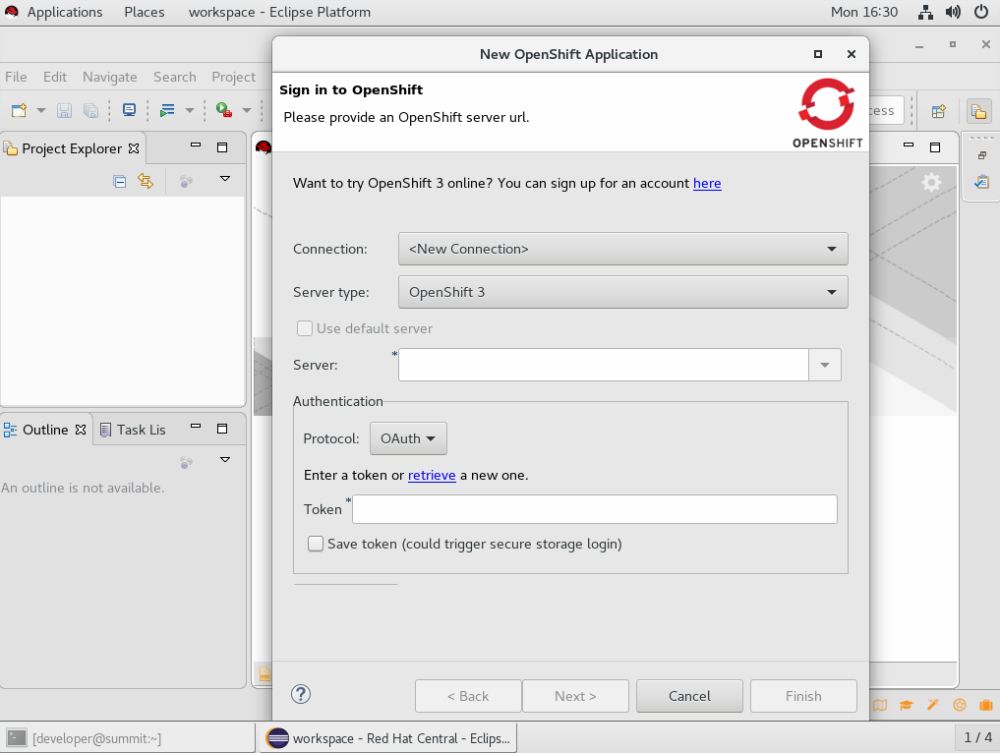
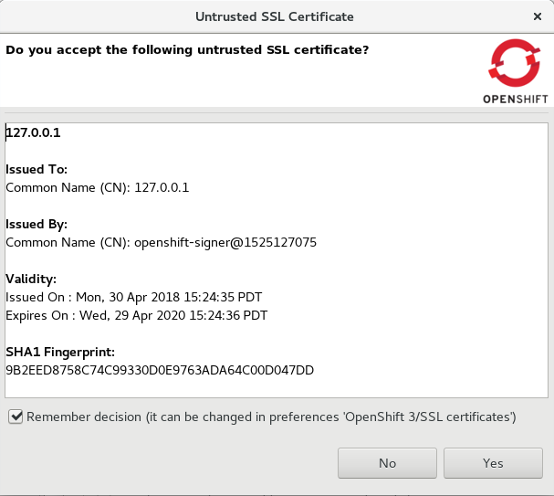
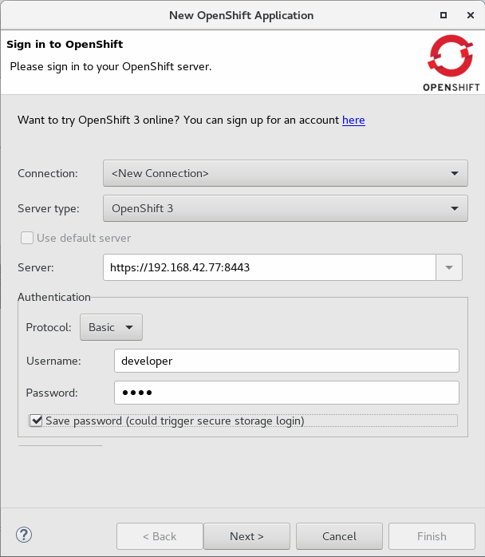

## Start JBoss Developer Studio and Setup CDK

In this lab, we will start JBDS and set up Red Hat Container Development Kit (CDK). 

**Red Hat® JBoss® Developer Studio** provides superior support for your entire development life cycle in one tool. It's a certified Eclipse-based integrated development environment (IDE) for developing, testing, and deploying rich web apps, mobile web apps, transactional enterprise apps, and microservices.

**Red Hat® Container Development Kit** provides a pre-built Container Development Environment based on Red Hat Enterprise Linux to help you develop container-based applications quickly. The containers you build can be easily deployed on any Red Hat container host or platform, including: Red Hat Enterprise Linux, Red Hat Enterprise Linux Atomic Host, and our platform-as-a-service solution, OpenShift Container Platform 3. This is Red Hat's supported version of the opensource [minishift](https://www.openshift.org/minishift/) project.


### Start JBDS

Start JBDS (Red Sphere Icon) from your application menu. The application starts up. It will prompt you to select a directory as workspace. You can `Browse` to change the location or just use the default.

**Note** If you have used JBDS or Eclipse before, you may want have conflict. You may have to clean up or use a different location. 

**Note** On windows this location shows up as `C:\Users\<username>\workspace`

**Note** If you're using RHEL, you can find those instructions [HERE](#rhel-workstation)



JBDS comes up and you will see the following screen. Spend a couple of minutes to understand the layout.


Since we also installed CDK, you'll see `Container Development Environment 3.2+` in  `Servers` tab.


### Setup CDK

Navigate to Servers tab. Right click on `Container Development Environment 3.2+` to get the menu. Select `Setup CDK` here.


CDK setup task cleans up `.minishift` folder in your user home and recreates it. This will clean up any old data if you used minishift in the past. This `.minishift` hidden folder stores all the configuration information about your CDK set up on your work station.

**Note** Sometimes you may see a permissions issue as below. This is noticed on Windows boxes. If it happens just run `Setup CDK` again and it should move on normally.

```
Setting up CDK 3 on host using 'C:/Users/veer/.minishift' as Minishift's home directory
Existing VM deleted
Error setting up CDK 3 environment: mkdir C:\Users\veer.minishift: Access is denied.

```

You'll see a warning about cleaning up the contents. Click `OK`.


CDK runs OpenShift and other components as containers. We have pre-downloaded openshift images and provided the on the flash drive for you. **This will save you on start up time in case internet is slow or in low network bandwidth situations.**

In order to use these pre-downloaded images let's run some commands from your terminal.


**Note** On Windows, Development Suite would have installed Cygwin. You can either use Cygwin to run the commands below or copy files using Windows File Explorer.

Let us first run a command to check the images available to minishift

```
$ minishift images list
```
The output should be empty.

Now let's copy the images. Navigate to the folder you copied from flash drive to your workstation and execute this copy command to copy the `images` folder to `cache` folder in the `.minishift` folder. This will create an `images` folder and copy all its contents.

```
$ cp -R images ~/.minishift/cache
```

**On Windows** We suggest that you should use Windows File Explorer to copy images to .minishift folder. But if you are using Cygwin, you may have to provide complete path as below:

```
$ cp -R images c:/users/<yourusername>/.minishift/cache
```

Now run check the images list again. This time it should display a bunch of images as shown below. If you did not copy these images, minishift/cdk will try to download them from Red Hat's registry on the fly and that may take a lot of time depending on the bandwidth. But if you are at home, you should be fine.

```
$ minishift images list
docker.io/fabric8/configmapcontroller:2.3.7
docker.io/fabric8/launcher-backend:latest
docker.io/fabric8/launcher-frontend:latest
registry.access.redhat.com/openshift3/ose-deployer:v3.9.14
registry.access.redhat.com/openshift3/ose-docker-registry:v3.9.14
registry.access.redhat.com/openshift3/ose-haproxy-router:v3.9.14
registry.access.redhat.com/openshift3/ose-pod:v3.9.14
registry.access.redhat.com/openshift3/ose-web-console:v3.9.14
registry.access.redhat.com/openshift3/ose:v3.9.14
registry.access.redhat.com/redhat-openjdk-18/openjdk18-openshift:latest
```

The next command will set the Minishift VM to use the cache for images instead of going to internet

```
$ minishift image cache-config add \
 docker.io/fabric8/configmapcontroller:2.3.7 \
 docker.io/fabric8/launcher-backend:latest \
 docker.io/fabric8/launcher-frontend:latest \
 registry.access.redhat.com/openshift3/ose-deployer:v3.9.14 \
 registry.access.redhat.com/openshift3/ose-docker-registry:v3.9.14 \
 registry.access.redhat.com/openshift3/ose-haproxy-router:v3.9.14 \
 registry.access.redhat.com/openshift3/ose-pod:v3.9.14 \
 registry.access.redhat.com/openshift3/ose-web-console:v3.9.14 \
 registry.access.redhat.com/openshift3/ose:v3.9.14 \
 registry.access.redhat.com/redhat-openjdk-18/openjdk18-openshift:latest
```

Verify that the cache-config is updated

```
$ minishift image cache-config view
docker.io/fabric8/configmapcontroller:2.3.7
docker.io/fabric8/launcher-backend:latest
docker.io/fabric8/launcher-frontend:latest
registry.access.redhat.com/openshift3/ose-deployer:v3.9.14
registry.access.redhat.com/openshift3/ose-docker-registry:v3.9.14
registry.access.redhat.com/openshift3/ose-haproxy-router:v3.9.14
registry.access.redhat.com/openshift3/ose-pod:v3.9.14
registry.access.redhat.com/openshift3/ose-web-console:v3.9.14
registry.access.redhat.com/openshift3/ose:v3.9.14
registry.access.redhat.com/redhat-openjdk-18/openjdk18-openshift:latest
```

Next we will size the minishift VM in terms of CPU and Memory. The default allocation would be insufficient for our subsequent labs. So let us increase a little bit. 

**Note** You need enough capacity on your workstation to do this.

Let's set the memory to 8GB and CPUs to 2 cores for your virtual machine by running the following commands

```
$ minishift config set memory 8192
No Minishift instance exists. New 'memory' setting will be applied on next 'minishift start'

$ minishift config set cpus 2
No Minishift instance exists. New 'cpus' setting will be applied on next 'minishift start'
```

As explained before the entire configuration of your CDK is saved inside `.minishift` folder. Verify your settings in the `.minishift/config/config.json` file.

```
$ cat ~/.minishift/config/config.json
{
    "addons": {
        "admin-user": {
            "Enabled": true,
            "Name": "admin-user",
            "Priority": 0
        },
        "anyuid": {
            "Enabled": true,
            "Name": "anyuid",
            "Priority": 0
        },
        "xpaas": {
            "Enabled": true,
            "Name": "xpaas",
            "Priority": 0
        }
    },
    "iso-url": "file:///Users/veer/.minishift/cache/iso/minishift-rhel7.iso",
    "memory": "8192",
    "vm-driver": "xhyve"
}

```
**On Windows** the vm-driver will show up as `hyperv`. If you have Oracle Virtual Box installed, it may show up as `virtualbox`. Also you can change the vm-driver to `virtualbox` by running the following command

```
$ minishift config set vm-driver virtualbox
```
If you double click on the Containers Development Environment in the Servers Tab, you should see virtualbox as the vm-driver


### Start CDK

Now it is time to start CDK. Go back to JBDS. Navigate to `Servers` tab. Right click on `Container Development Environment 3.2+` to get the menu. Select `Start` here.



Watch out for logs in the `Console` tab. It takes a couple of minutes to start up minishift/CDK. 

You should see logs as below: 

```
-- Starting profile 'minishift'
-- Checking if requested OpenShift version 'v3.9.14' is valid ... OK
-- Checking if requested OpenShift version 'v3.9.14' is supported ... OK
-- Checking if requested hypervisor 'xhyve' is supported on this platform ... OK
-- Checking if xhyve driver is installed ... 
   Driver is available at /usr/local/bin/docker-machine-driver-xhyve
   Checking for setuid bit ... OK
-- Checking the ISO URL ... OK
-- Checking if provided oc flags are supported ... OK
-- Starting local OpenShift cluster using 'xhyve' hypervisor ...
-- Minishift VM will be configured with ...
   Memory:    8 GB
   vCPUs :    2
   Disk size: 20 GB
-- Starting Minishift VM ................ OK
-- Registering machine using subscription-manager
   Registration in progress .......... OK [20s]
-- Checking for IP address ... OK
-- Checking for nameservers ... OK
-- Checking if external host is reachable from the Minishift VM ... 
   Pinging 8.8.8.8 ... OK
-- Checking HTTP connectivity from the VM ... 
   Retrieving http://minishift.io/index.html ... OK
-- Checking if persistent storage volume is mounted ... OK
-- Checking available disk space ... 1% used OK
   Importing 'docker.io/fabric8/configmapcontroller:2.3.7' . OK
   Importing 'docker.io/fabric8/launcher-backend:latest' ....... OK
   Importing 'docker.io/fabric8/launcher-frontend:latest' .... OK
   Importing 'registry.access.redhat.com/openshift3/ose-deployer:v3.9.14' .......... OK
   Importing 'registry.access.redhat.com/openshift3/ose-docker-registry:v3.9.14' .. OK
   Importing 'registry.access.redhat.com/openshift3/ose-haproxy-router:v3.9.14' .. OK
   Importing 'registry.access.redhat.com/openshift3/ose-pod:v3.9.14' . OK
   Importing 'registry.access.redhat.com/openshift3/ose-web-console:v3.9.14' .. OK
   Importing 'registry.access.redhat.com/openshift3/ose:v3.9.14' .. OK
-- OpenShift cluster will be configured with ...
   Version: v3.9.14
Using nsenter mounter for OpenShift volumes
Using 192.168.64.16 as the server IP
Starting OpenShift using registry.access.redhat.com/openshift3/ose:v3.9.14 ...
OpenShift server started.

The server is accessible via web console at:
    https://192.168.64.16:8443

You are logged in as:
    User:     developer
    Password: <any value>

To login as administrator:
    oc login -u system:admin

-- Waiting for persistent volumes to be created ... OK

-- Applying addon 'admin-user':..
-- Applying addon 'anyuid':.
 Add-on 'anyuid' changed the default security context constraints to allow pods to run as any user.
 Per default OpenShift runs containers using an arbitrarily assigned user ID.
 Refer to https://docs.openshift.org/latest/architecture/additional_concepts/authorization.html#security-context-constraints and
 https://docs.openshift.org/latest/creating_images/guidelines.html#openshift-origin-specific-guidelines for more information.
-- Applying addon 'xpaas':....................................................................................................
XPaaS OpenShift imagestream and templates installed
See https://github.com/openshift/openshift-ansible/tree/master/roles/openshift_examples/files/examples/v3.7

```
While minishift comes up you'll be prompted to accepted untrusted certificate. Click `Yes` button.



**Note** from the above logs that minishift is configured with the sizes you configured

```
-- Minishift VM will be configured with ...
   Memory:    8 GB
   vCPUs :    2
   Disk size: 20 GB
```

**Note** from the above logs the following import steps are successful indicating that the images are imported from the cache instead of being downloaded via internet.

```
   Importing 'docker.io/fabric8/configmapcontroller:2.3.7' . OK
   Importing 'docker.io/fabric8/launcher-backend:latest' ....... OK
   Importing 'docker.io/fabric8/launcher-frontend:latest' .... OK
   Importing 'registry.access.redhat.com/openshift3/ose-deployer:v3.9.14' .......... OK
   Importing 'registry.access.redhat.com/openshift3/ose-docker-registry:v3.9.14' .. OK
   Importing 'registry.access.redhat.com/openshift3/ose-haproxy-router:v3.9.14' .. OK
   Importing 'registry.access.redhat.com/openshift3/ose-pod:v3.9.14' . OK
   Importing 'registry.access.redhat.com/openshift3/ose-web-console:v3.9.14' .. OK
   Importing 'registry.access.redhat.com/openshift3/ose:v3.9.14' .. OK
```

Also note the URL for the webconsole and the credentials to log into CDK. Once  minishift comes up you will be taken to `OpenShift Explorer` tab where you'll find a link to the OpenShift Cluster. Click in to navigate and see that there is a project named `My Project` created by default


### Access OpenShift Master

Type in the master URL, in my case it is https://192.168.64.16:8443, in your browser (Google Chrome preferred). 

You'll see a warning due to certificate. Click on `Advanced` and select `Proceed to 192.168.64.16(unsafe)`



You'll see login screen for OpenShift WebConsole. Type in `developer` as the username and any password. Click on `Log In` button.


You should now see OpenShift Catalog and a menu `My Project` under the list of project on the OpenShift Webconsole.


### RHEL Workstation

If you're using a RHEL workstation; start the CDK with the following

Export your developer entitlement account
```
$ export MINISHIFT_USERNAME='<RED_HAT_USERNAME>'
$ export MINISHIFT_PASSWORD='<RED_HAT_PASSWORD>'
```

Let us first run a command to check the images available to minishift

```
$ minishift images list
```
The output should be empty.

Now let's copy the images. Navigate to the folder you copied from flash drive to your workstation and execute this copy command to copy the `images` folder to `cache` folder in the `.minishift` folder. This will create an `images` folder and copy all its contents.

```
$ cp -R images ~/.minishift/cache
```

Now run check the images list again. This time it should display a bunch of images as shown below. If you did not copy these images, minishift/cdk will try to download them from Red Hat's registry on the fly and that may take a lot of time depending on the bandwidth. But if you are at home, you should be fine.

```
$ minishift images list
registry.access.redhat.com/openshift3/ose-deployer:v3.9.14
registry.access.redhat.com/openshift3/ose-docker-registry:v3.9.14
registry.access.redhat.com/openshift3/ose-haproxy-router:v3.9.14
registry.access.redhat.com/openshift3/ose-pod:v3.9.14
registry.access.redhat.com/openshift3/ose-web-console:v3.9.14
registry.access.redhat.com/openshift3/ose:v3.9.14
```

Next we will size the minishift VM in terms of CPU and Memory. The default allocation would be insufficient for our subsequent labs. So let us increase a little bit. 

**Note** You need enough capacity on your workstation to do this.

Let's set the memory to 8GB and CPUs to 2 cores for your virtual machine by running the following commands

```
$ minishift config set memory 8192
No Minishift instance exists. New 'memory' setting will be applied on next 'minishift start'

$ minishift config set cpus 2
No Minishift instance exists. New 'cpus' setting will be applied on next 'minishift start'
```

As explained before the entire configuration of your CDK is saved inside `.minishift` folder. Verify your settings in the `.minishift/config/config.json` file.

```
$ cat ~/.minishift/config/config.json
{
    "addons": {
        "admin-user": {
            "Enabled": true,
            "Name": "admin-user",
            "Priority": 0
        },
        "anyuid": {
            "Enabled": true,
            "Name": "anyuid",
            "Priority": 0
        },
        "xpaas": {
            "Enabled": true,
            "Name": "xpaas",
            "Priority": 0
        }
    },
    "iso-url": "file:///Users/veer/.minishift/cache/iso/minishift-rhel7.iso",
    "memory": "8192",
    "vm-driver": "xhyve"
}

```

After that, start minitshift 

```
$ minishift start
```

**NOTE:** This may prompt you for your workstation credentials.

Obtain your minishift URL (Save this infomation as you'll need it.)

```
$ minishift console --url
```

To launch Red Hat Eclipse navigate to `Applications ~> Programming ~> Red Hat Eclipse 4.7.x`



Once you've launched; set the workspace path (noted above). You can connect to your minishift cdk by clicking `OpenShift Application` on the workbench screen



This brings up the following window



Under `Server` add the output of `minishift console --url` that you got from above. It'll ask you to accept the cert



Under `Authentication`; change the protocol to `Basic`, and enter `developer` for the `Username` and `openshift` for the `Password`. Make sure to tick `Save Password`



Once you click `Next` it should log you in and ask what kind of application you want to create; you can go ahead and click `Cancel`


**Extra Credits:** Figure out how to stop CDK.


Congratulations!! You have started CDK and logged into OpenShift Webconsole provided by CDK.
