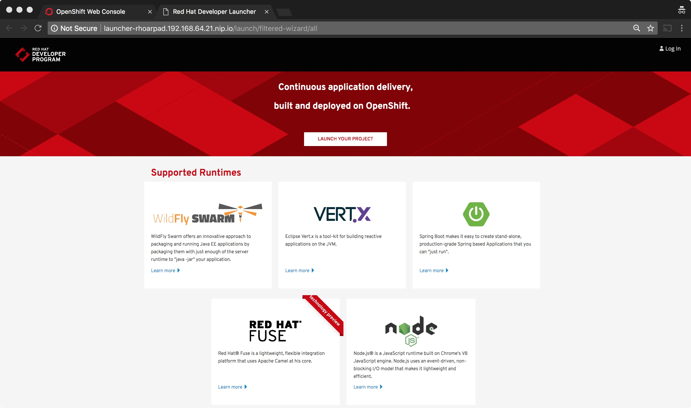

## Install RHOAR Launch Pad on your CDK

In this lab, we will install LaunchPad for RHOAR. We will use Fabric8 Launcher that is described [here](https://appdev.openshift.io/docs/minishift-installation.html#introduction-to-the-launcher-application).

We will use a minishift addon to create this launcher.

### Prerequisites
1. CDK is installed on your workstation
2. You need a GitHub Account. If you don't have please create one at


### Start CDK
* Start CDK based on what you learnt in the last lab
* Open a terminal to run commands using CLI.


### Install Fabric8 Launcher Addon

Navigate to the folder where you copied the flash drive contents. Then change into `addons` folder. Run the following command to install Fabric8 Launcher

```
$ minishift addon install ./fabric8-launcher
```

You should get a response

```
Addon 'fabric8-launcher' installed
```

### Generate GitHub Token

* As mentioned in the pre-requisites, you'll need a github account. 
* Navigate to [https://github.com/settings/tokens](https://github.com/settings/tokens)
* Select Generate new token
* Add a token description, for example Fabric8 Launcher tool on a Single-node OpenShift Cluster.
* Select the check boxes of the following parent scopes and all their children:
	* public_repo
	* read:org
	* admin:repo_hook
* Click `Generate Token`
* Save the hex code of the personal access token.


### Deploy the Launcher

To deploy the launcher you need supply your github username and github token you noted in the previous step. Run the following command substituting the values.

```
$ minishift addons apply fabric8-launcher \
   --addon-env GITHUB_USERNAME=<yourgithubusername> \
   --addon-env GITHUB_TOKEN=<yourtoken>
```

You'll see a response like below

```
-- Applying addon 'fabric8-launcher':....
```

This creates a project with name `rhoarpad` and spins up the launcher in that project. 

Navigate to the project in the web console and you'll see the following in a couple of minutes.


### Start Launcher

Click on the Launcher URL in the browser and you should see a screen like below.


Congratulations!!! You have deployed RHOAR Launcher.


