## Lab 1:  Creating SpringBoot Rest Services

In this lab we will create 3 rest services based on SpringBoot
* Creating SpringBoot Rest Services  
	* Adjective Service  
	* Noun Service  
	* Insult Service  
* Service Discovery  
* Unit testing -  RestAssured  
* Integration testing -Arquillian Cube  
* Health Check and Service Healing  
* Circuit Breaker   


### Pre-requisites 

Must have completed labs 1-3. We will be using those components for following labs

### Description
The idea of this lab is to generate to random noun and an adjective to generate an insult. It is based on the following idea:  
http://www.literarygenius.info/a1-shakespearean-insults-generator.htm  

### Steps
We will clone a sample project from Github.  If you don't have Git installed you can download a zip file.

The project we use will be based on the REST level 0 example application from OpenShift Launcher.  You can find OpenShift Launcher at https://launch.openshift.io 

####  Clone the repository or download the zip file 

[bash]
`git clone https://github.com/jeremyrdavis/smart-appliance.git`

Download the zip file from Github by opening https://github.com/jeremyrdavis/smart-appliance-zip
and choosing, "Download ZIP" from the green, "Clone or Download" button

#### Import the app into VS Code

Open Visual Studio Code, choose "Open," and navigate to the root folder of the project


#### Build the app

We will use Maven to build our app.  Open a new Terminal either from the command line or within Visual Studio Code by choosing, "Terminal -> New Terminal"


```
mvn clean package
```

The tests should all complete successfully, and you should see a success message.

  

  


Via commandline
```
oc get routes -n rhoarpad
```	

#### LaunchPad Steps  
Step 1: Click on ‘Launch Your Project ‘  
Step 2: Select Deployment Type ‘I will build and run locally’  
Step 3: Select 'Rest API Level 0' and hit ‘Continue’  


Step 4: Select Runtime  - ‘Spring Boot’ and hit ‘ Next’  
Step 5: Add properties
* Update Artifact ID to "springboot-adj"

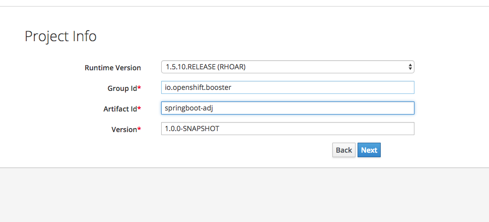  


**Note - Please try to keep the names as we would be referring them with same names through out the lab.**  

Step 6: Summary Screen - Please review carefully and hit ‘Download as zip’  
Step 7: Copy the zip file into which ever workspace directory you choose and unzip it

#### Importing Project into JBoss Developer Studio  


**Note - Please ensure you are logged into openshift in the springbootapps project.**  

```
oc new-project springbootapps
oc project springbootapps
```

Update the Run configurations for you maven build. We will add the fabric8 plugin command to deploy into our openshift cluster

The fabric8-maven-plugin is a Maven plugin that accelerates development by allowing easy and quick deployment of Java applications to OpenShift. This plugin reduces the required steps by building the application, creating a docker image and deploying it to OpenShift in a single command, which is especially useful in the development stage, where multiple retries often accompany each step.

  
  

You should see a successful deployment  

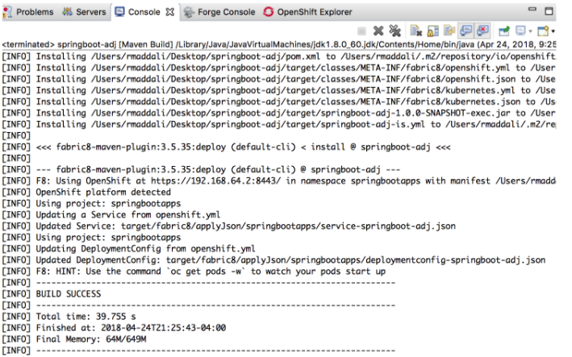 

#### Validating the deployment:  

Step1: Login to OpenShift Console - with user admin/admin
Step2: Click on Project ‘springboot-apps’
Step3: You should pod running. See below pic for reference


 


Step4: Clock on the route URL on the right corner.   

Similar to this  
http://springboot-adj-springbootapps.192.168.64.2.nip.io/  

You should see this  

 

###  Create Adjective Rest Service

Now that we got an understanding on how build and deploy works, lets create a new service for returning list of adjectives

#### Create Adjective Model Class  

Step1: File->New->Class.  
Step2: Enter package name - io.openshift.booster.adjective.model  
Step3: Class Name: Adjective  

 


 


#### Now that we got an understanding on how build and deploy works, lets create a new service for returning list of adjectives  


Create Adjective Model Class  
Step1: File->New->Class.  
Step2: Enter package name - io.openshift.booster.adjective.model  
Step3: Class Name: Adjective  


 


```java
package io.openshift.booster.adjective.model;

import java.util.Objects;

public class Adjective {

	
	private String adjective;

    public Adjective() {
    }

    public Adjective(String adjective) {
        this.adjective = adjective;
    }

    public String getAdjective() {
        return adjective;
    }

    public Adjective adjective(String adjective) {
        this.adjective = adjective;
        return this;
    }

    @Override
    public boolean equals(Object o) {
        if (this == o) return true;
        if (o == null || getClass() != o.getClass()) return false;
        Adjective adjective1 = (Adjective) o;
        return Objects.equals(adjective, adjective1.adjective);
    }

    @Override
    public int hashCode() {
        return Objects.hash(adjective);
    }

    @Override
    public String toString() {
        final StringBuffer sb = new StringBuffer("Adjective{");
        sb.append("adjective='").append(adjective).append('\'');
        sb.append('}');
        return sb.toString();
    }
	
}
```


#### Create Adjective Spring Rest Service  

Step1: File->New->Class  
Step2: Enter package name - io.openshift.booster.adjective.service  
Step3: Class Name: AdjectiveServiceController  


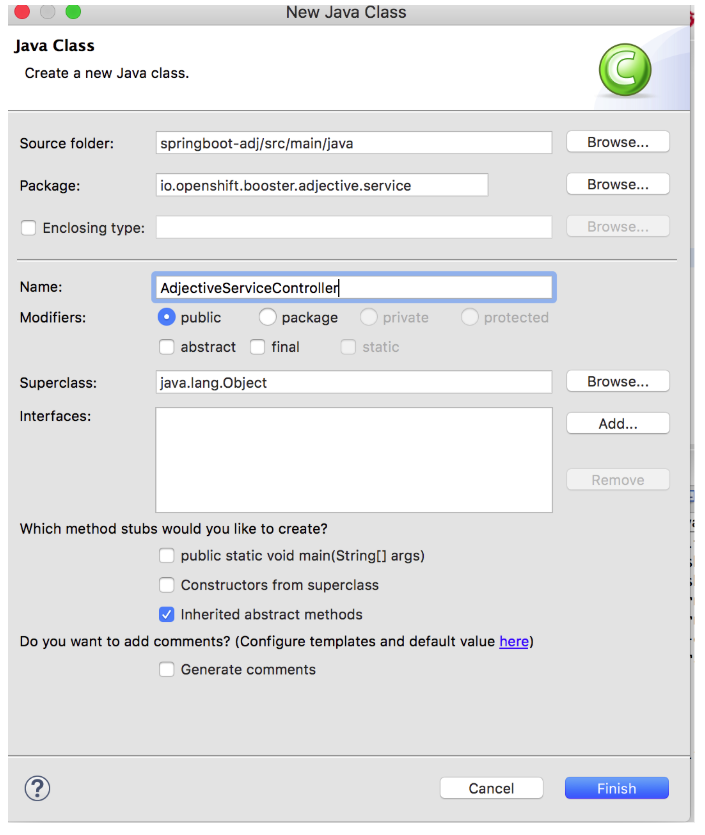 


Step4: Here is the code for AdjectiveServiceController.


```java
/*
 * Copyright 2016-2017 Red Hat, Inc, and individual contributors.
 *
 * Licensed under the Apache License, Version 2.0 (the "License");
 * you may not use this file except in compliance with the License.
 * You may obtain a copy of the License at
 *
 * http://www.apache.org/licenses/LICENSE-2.0
 *
 * Unless required by applicable law or agreed to in writing, software
 * distributed under the License is distributed on an "AS IS" BASIS,
 * WITHOUT WARRANTIES OR CONDITIONS OF ANY KIND, either express or implied.
 * See the License for the specific language governing permissions and
 * limitations under the License.
 */
package io.openshift.booster.adjective.service;

import java.io.BufferedReader;
import java.io.InputStream;
import java.io.InputStreamReader;
import java.util.ArrayList;
import java.util.List;
import java.util.Random;

import javax.annotation.PostConstruct;
import javax.ws.rs.GET;
import javax.ws.rs.Path;
import javax.ws.rs.Produces;

import org.springframework.core.io.ClassPathResource;
import org.springframework.core.io.Resource;
import org.springframework.stereotype.Component;

import io.openshift.booster.adjective.model.Adjective;

@Path("/")
@Component
public class AdjectiveServiceController {
    
    private List<Adjective> adjectives = new ArrayList<>();


    

    
    
    
    @GET
    @Path("/adjective")
    @Produces("application/json")
    public Adjective getAdjective() {
       
    	System.out.println(" called"+adjectives.size());
    	
        return adjectives.get(new Random().nextInt(adjectives.size()));
    }
    
    
    @PostConstruct
    public void init() {
        
    	
    	try {
            System.out.println("init called");
    		
    		
    		Resource resource = new ClassPathResource("adjectives.txt");
    		InputStream is = resource.getInputStream();
            if (is != null) {
                BufferedReader reader = new BufferedReader(new InputStreamReader(is));
                reader.lines()
                        .forEach(adj -> adjectives.add(new Adjective(adj.trim())));
            }
        } catch (Exception e) {
            e.printStackTrace();
        }
    	
    }
}

```


Create a adjective text file 


Step1: File->New -> File under src/main/resources

Step2: name of file: adjectives.txt

Step 3: Once the file is created, paste the following content 

```
artless
base-court
bawdy
bat-fowling
beslubbering
beef-witted
bootless
beetle-headed
churlish
boil-brained
cockered
clapper-clawed
clouted
clay-brained
craven
common-kissing
currish
crook-pated
dankish
dismal-dreaming
dissembling
dizzy-eyed
droning
doghearted
errant
dread-bolted
fawning
earth-vexing
fobbing
elf-skinned
froward
fat-kidneyed
frothy
fen-sucked
gleeking
flap-mouthed
goatish
fly-bitten
gorbellied
folly-fallen
impertinent
fool-born
infectious
full-gorged
jarring
guts-griping
loggerheaded
half-faced
lumpish
hasty-witted
mammering
hedge-born
mangled
hell-hated
mewling
idle-headed
paunchy
ill-breeding
pribbling
ill-nurtured
puking
knotty-pated
puny
milk-livered
qualling
motley-minded
rank
onion-eyed
reeky
plume-plucked
roguish
pottle-deep
ruttish
pox-marked
saucy
reeling-ripe
spleeny
rough-hewn
spongy
rude-growing
surly
rump-fed
tottering
shard-borne
unmuzzled
sheep-biting
vain
spur-galled
venomed
swag-bellied
villainous
tardy-gaited
warped
tickle-brained
wayward
toad-spotted
weedy
unchin-snouted
yeasty
weather-bitten
cullionly
whoreson
fusty
malmsey-nosed
caluminous
rampallian
wimpled
lily-livered
burly-boned
scurvy-valiant
misbegotten
brazen-faced
odiferous
unwash'd
poisonous
bunch-back'd
fishified
leaden-footed
wart-necked
muddy-mettled
pigeon-liver'd
scale-sided
```

File is located here for review

https://raw.githubusercontent.com/rmaddali/summit-cloudnative-workshop/master/springboot-adjective-service/src/main/resources/adjectives.txt


Edit index.html file ( under src/main/resources/static folder)

```
<html>
<head>
    <meta charset="utf-8">
    <title>API Level 0 Mission - Spring Boot</title>
    <link rel="stylesheet" href="https://maxcdn.bootstrapcdn.com/bootstrap/3.3.7/css/bootstrap.min.css"
          integrity="sha384-BVYiiSIFeK1dGmJRAkycuHAHRg32OmUcww7on3RYdg4Va+PmSTsz/K68vbdEjh4u" crossorigin="anonymous">
</head>

<body>
<div class="container">
    <div class="row">
        <div class="sect1">
<h2 id="_http_booster">HTTP Booster</h2>
<div class="sectionbody">
<div class="paragraph">
<p>Adjective Service Rest Endpoint</p>
</div>
<div class="sect2">
<h3 id="_using_the_greeting_service">Using the Adjective service</h3>

</div>
</div>
</div>

        <form class="form-inline">
            <div class="form-group">
                <label for="name">Name</label>
                <input type="text" class="form-control" id="name" placeholder="World">
            </div>
            <button id="invoke" type="submit" class="btn btn-success">Invoke</button>
        </form>

        <p class="lead">Result:</p>
        <pre><code id="greeting-result">Invoke the service to see the result.</code></pre>
    </div>
</div>

<script src="https://ajax.googleapis.com/ajax/libs/jquery/1.12.4/jquery.min.js"></script>
<script src="https://maxcdn.bootstrapcdn.com/bootstrap/3.3.7/js/bootstrap.min.js"
        integrity="sha384-Tc5IQib027qvyjSMfHjOMaLkfuWVxZxUPnCJA7l2mCWNIpG9mGCD8wGNIcPD7Txa"
        crossorigin="anonymous"></script>

<script>
  $(document).ready(function () {
    $("#invoke").click(function (e) {
      var n = $("#name").val() || "World";
      $.getJSON("/api/adjective?name=" + n, function (res) {
        $("#greeting-result").text(JSON.stringify(res));
      });
      e.preventDefault();
    });
  });
</script>

</body>

</html>

```

Thats it - we are done. Let’s quickly redeploy the app to openshift  


#### Deploy the service to Openshift   
Step 1: right click -> ‘Run As’ ->Run Configuration ->Select maven profile ‘springboot-adj’ and hit ‘Run’  


 

Access the new service at the following location and hit ‘Invoke’ button  

http://springboot-adj-springbootapps.192.168.64.2.nip.io/  


 


#### Create Noun Spring Rest Service  


Step 2: Click on ‘Launch Your Project ‘  
Step 3: Select Deployment Type i.e ‘Build and Deploy Locally’  
Step 4: Select Below ‘Mission and hit ‘Continue’  

 


Step 5: Select Runtime  - ‘Spring Boot’ and hit ‘ Next’  
Step 6: Give project info as follows and hit ‘Next’  

  


Step 7: hit ‘Download as Zip file’, Download should begin on your system  

Step8: Unzip the project  

#### Import Project into Eclipse  
Step1: Open JBoss Developer Studio(JBDS) .  
Step2: File ->Import ->Existing Maven Projects , select the project that you downloaded to your file system  


####  Create Noun Model Class  

Step1: File->New->Class.  
Step2: Enter package name - io.openshift.booster.noun.model  
Step3: Class Name: Noun  


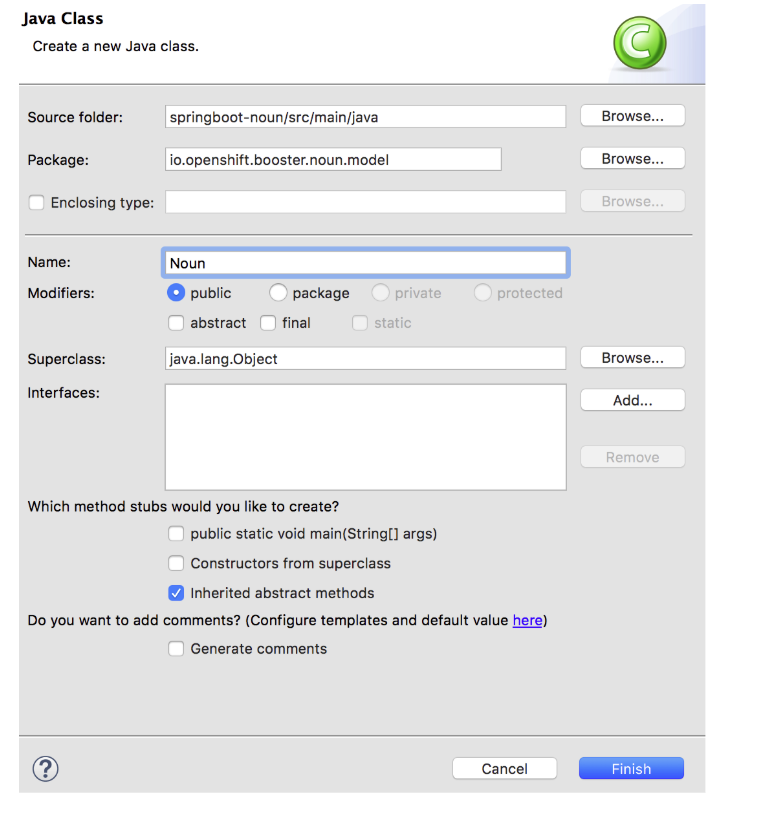  


````java
package org.springboot.noun.service.model;

import java.util.Objects;

public class Noun
{
  private String noun;
  
  public Noun() {}
  
  public Noun(String noun)
  {
    this.noun = noun;
  }
  
  public String getNoun() {
    return noun;
  }
  
  public Noun noun(String noun) {
    this.noun = noun;
    return this;
  }
  
  public boolean equals(Object o)
  {
    if (this == o) return true;
    if ((o == null) || (getClass() != o.getClass())) return false;
    Noun noun1 = (Noun)o;
    return Objects.equals(noun, noun);
  }
  
  public int hashCode()
  {
    return Objects.hash(new Object[] { noun });
  }
  
  public String toString()
  {
    StringBuffer sb = new StringBuffer("Noun{");
    sb.append("noun='").append(noun).append('\'');
    sb.append('}');
    return sb.toString();
  }
}
````


https://raw.githubusercontent.com/rmaddali/summit-cloudnative-workshop/master/springboot-noun-service/src/main/java/org/springboot/noun/service/model/Noun.java


####  Create Noun Rest Class  

Package: io.openshift.booster.noun.service  
Name: NounServiceController  


  

```java
package io.openshift.booster.noun.service;

import java.io.BufferedReader;
import java.io.InputStream;
import java.io.InputStreamReader;
import java.util.ArrayList;
import java.util.List;
import java.util.Random;
import java.util.concurrent.atomic.AtomicLong;

import javax.annotation.PostConstruct;
import javax.ws.rs.GET;
import javax.ws.rs.Path;
import javax.ws.rs.Produces;

import org.springframework.core.io.ClassPathResource;
import org.springframework.core.io.Resource;
import org.springframework.stereotype.Component;

import io.openshift.booster.noun.model.Noun;

@Path("/")
@Component

public class NounServiceController {
   
    private final AtomicLong counter = new AtomicLong();
    private List<Noun> nouns = new ArrayList<Noun>();

    @GET
    @Path("/noun")
    @Produces("application/json")
    public Noun getNoun() {
        return this.nouns.get(new Random().nextInt(this.nouns.size()));
    }

    @PostConstruct
    public void loadData() {
        try {
        	Resource resource = new ClassPathResource("noun.txt");
    		InputStream is = resource.getInputStream();
            
            if (is != null) {
                BufferedReader reader = new BufferedReader(new InputStreamReader(is));
                reader.lines().forEach(noun -> {
                    this.nouns.add(new Noun(noun.trim()));
                }
                );
            }
        }
        catch (Exception e) {
            e.printStackTrace();
        }
    }
}
```


Step3: Create noun.txt file under src/main/resources  


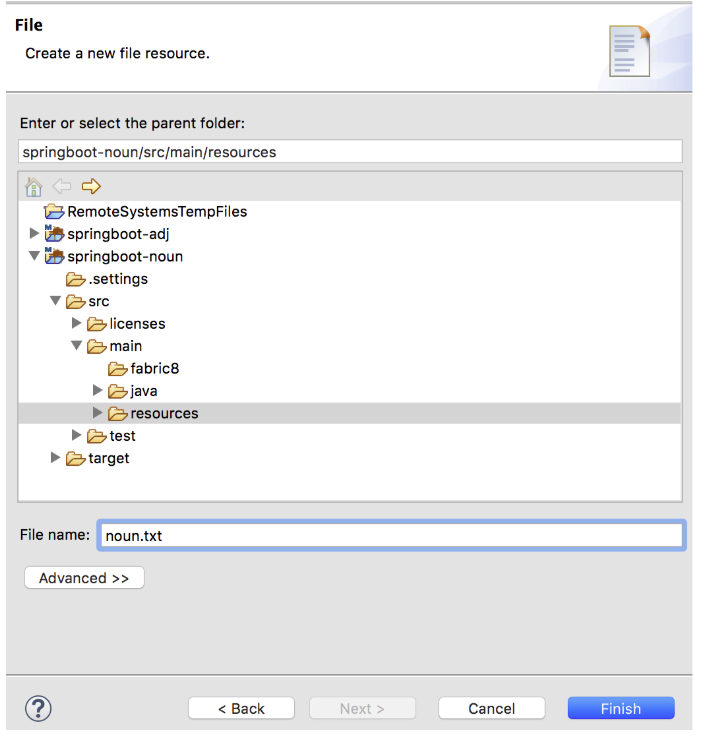  


```
apple-john
 baggage
 barnacle
 bladder
 boar-pig
 bugbear
 bum-bailey
 canker-blossom
 clack-dish
 clotpole
 coxcomb
 codpiece
 death-token
 dewberry
 flap-dragon
 flax-wench
 flirt-gill
 foot-licker
 fustilarian
 giglet
 gudgeon
 haggard
 harpy
 hedge-pig
 horn-beast
 hugger-mugger
 joithead
 lewdster
 lout
 maggot-pie
 malt-worm
 mammet
 measle
 minnow
 miscreant
 moldwarp
 mumble-news
 nut-hook
 pigeon-egg
 pignut
 puttock
 pumpion
 ratsbane
 scut
 skainsmate
 strumpet
 varlot
 vassal
 whey-face
 wagtail
 knave
 blind-worm
 popinjay
 scullian
 jolt-head
 malcontent
 devil-monk
 toad
 rascal
 Basket-Cockle
 rapscallion
```


Step5: Edit index.html  

```
<html>
<head>
    <meta charset="utf-8">
    <title>API Level 0 Mission - Spring Boot</title>
    <link rel="stylesheet" href="https://maxcdn.bootstrapcdn.com/bootstrap/3.3.7/css/bootstrap.min.css"
          integrity="sha384-BVYiiSIFeK1dGmJRAkycuHAHRg32OmUcww7on3RYdg4Va+PmSTsz/K68vbdEjh4u" crossorigin="anonymous">
</head>

<body>
<div class="container">
    <div class="row">
        <div class="sect1">
<h2 id="_http_booster">Noun Service</h2>
<div class="sectionbody">
<div class="paragraph">
<p>An example of simple mapping of a business operation to a remote endpoint. By taking this approach, clients use the HTTP protocol as a transport mechanism to call services. Application engineers define the APIs using a broad interpretation of the REST fundamentals, encouraging freedom in design and quick prototyping.</p>
</div>
<div class="sect2">
<h3 id="_using_the_greeting_service">Using the Noun service</h3>

</div>
</div>
</div>

        <form class="form-inline">
            <div class="form-group">
                <label for="name">Name</label>
                <input type="text" class="form-control" id="name" placeholder="World">
            </div>
            <button id="invoke" type="submit" class="btn btn-success">Invoke</button>
        </form>

        <p class="lead">Result:</p>
        <pre><code id="greeting-result">Invoke the service to see the result.</code></pre>
    </div>
</div>

<script src="https://ajax.googleapis.com/ajax/libs/jquery/1.12.4/jquery.min.js"></script>
<script src="https://maxcdn.bootstrapcdn.com/bootstrap/3.3.7/js/bootstrap.min.js"
        integrity="sha384-Tc5IQib027qvyjSMfHjOMaLkfuWVxZxUPnCJA7l2mCWNIpG9mGCD8wGNIcPD7Txa"
        crossorigin="anonymous"></script>

<script>
  $(document).ready(function () {
    $("#invoke").click(function (e) {
      var n = $("#name").val() || "World";
      $.getJSON("/api/noun", function (res) {
        $("#greeting-result").text(JSON.stringify(res));
      });
      e.preventDefault();
    });
  });
</script>

</body>

</html>
```


Step 1: right click -> ‘Run As’ ->Run Configuration ->Select maven profile ‘springboot-adj’ and hit ‘Run’  

You should see the build success message as follows  

Select new configuration on the left top corner, give details as follows  


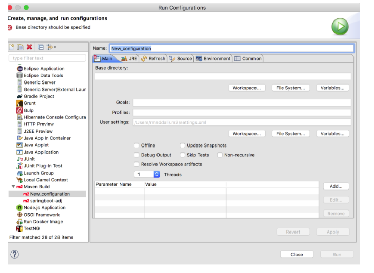  


Name: springboot-noun-deploy  
BaseDirectory: workspace->select springboot-noun  
Goals: clean fabric8:deploy -Popenshift  

Hit ‘Run’  

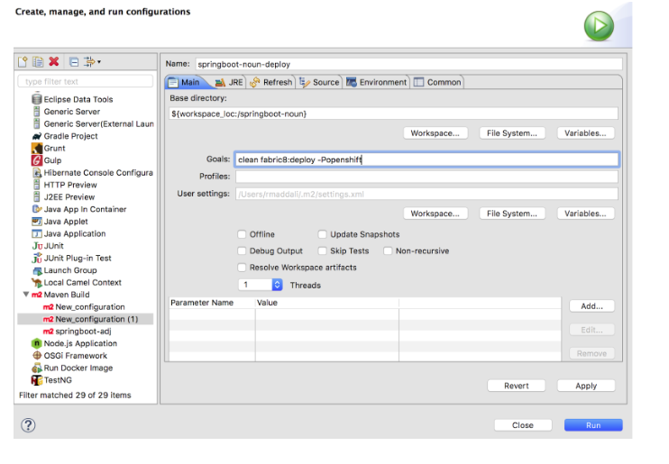  


You should see a maven build successful message  


Access the application under following URL and hit ‘Invoke’  

http://springboot-noun-springbootapps.192.168.64.2.nip.io/  


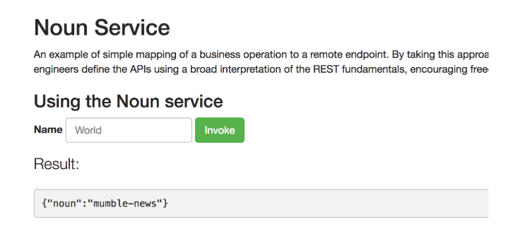  


#### Create Insult Spring Rest Service  

Step 0: Login to OpenShift console at $OCP-CONSOLE-URL/console with credentials - admin/admin  

Step1: Go to Lauchpad url. (Need to replace with launchpad url from VM)  

http://launcher-frontend-my-launcher.192.168.64.2.nip.io/launch/filtered-wizard/all  

Step 2: Click on ‘Launch Your Project ‘  
Step 3: Select Deployment Type i.e ‘Download Zip’  
Step 4: Select Below ‘Mission and hit ‘Continue’  


  


Step 5: Select Runtime  - ‘Spring Boot’ and hit ‘ Next’  

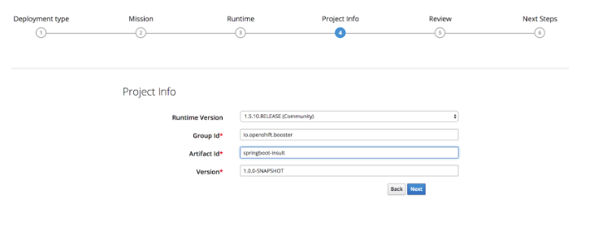  


Step 7: hit ‘Download as Zip file’, Download should begin on your system  

Step8: Unzip the project  


#### Import Project into Eclipse

Step1: Open JBoss Developer Studio(JBDS) .  
Step2: File ->Import ->Existing Maven Projects , select the project that you downloaded to your file system  


  


#### Create Insult Model Class  

Step1: File->New->Class.  
Step2: Enter package name - io.openshift.booster.insult.model  
Step3: Class Name: Insult  


```java
package io.openshift.booster.insult.model;

public class Insult {
	
	private String content;
	

	public Insult() {
		
		this.content = null;
	}

	public Insult( String content) {
		
		this.content = content;
	}

	public String getContent() {
		return content;
	}

	public void setContent(String content) {
		this.content = content;
	}
	
	
	
	

}
```


#### Create AdjectiveService Class - Service Discovery  

Services are implemented by one or more pods for Elasticity and Resilience. In the cloud pods can come and go when there are hardware failures or when pods get rescheduled onto different nodes to improve resource utilisation.  
To use a service you need to dynamically discover the pods implementing the service so that you can invoke it. This is called service discovery.  

The default way to discover the pods for a kubernetes service is via DNS names  

For a service named foo-bar you can just hard code the host name foo-bar in your application code.  
e.g. to access a HTTP URL use http://foo-bar/ or for HTTPS use https://foo-bar/ (assuming the service is using the port 80 or 443 respectively).  
If you use a non standard port number, say, 1234, then append that port number to your URL such as http://foo-bar:1234/.  
Note that DNS works in kubernetes by resolving to the service named foo-bar in the namespace of your pods so you don’t have to worry about configuring your application with environment specific configuration or worry about accidentally talking to the production service when in a testing environment! You can then move your application (its docker image and kubernetes metadata) into any environment and your application works without any changes!  


In the example we demonstrate service discovery i.e insult service calling Adjective and Noun service   


Step1  
Package: io.openshift.booster.insult.service  
Name: AdjectiveService  


  

Here is the code for AdjectiveService

```java
package io.openshift.booster.insult.service;

import org.springframework.stereotype.Service;
import org.springframework.web.client.RestTemplate;


@Service
public class AdjectiveService {

	
	 private final RestTemplate restTemplate = new RestTemplate();
	 private final String adjectiveHost = System.getProperty("adjective.host", "http://springboot-adj:8080");
	
	 
	public String getAdjective() {
		
		System.out.println("ServiceName host="+adjectiveHost);
	    return restTemplate.getForObject(adjectiveHost + "/api/adjective", String.class);
	  }
		      
		      
}
```

#### Create NounService Class  
Step1   
Package: io.openshift.booster.insult.service  
Name: NounService  


  


```java
package io.openshift.booster.insult.service;

import org.springframework.stereotype.Service;
import org.springframework.web.client.RestTemplate;


@Service
public class NounService {

	
	private String nounServiceName;
	 private final RestTemplate restTemplate = new RestTemplate();
	 private final String nounHost = System.getProperty("noun.host", "http://springboot-noun-service:8080");
	
	public String getNoun() {
		
		System.out.println("NounServiceName="+nounHost);
	    return restTemplate.getForObject(nounHost + "/api/noun", String.class);
	  }
}

```


#### Create InsultService Class  
Step1   
Package: io.openshift.booster.insult.service  
Name: InsultService  


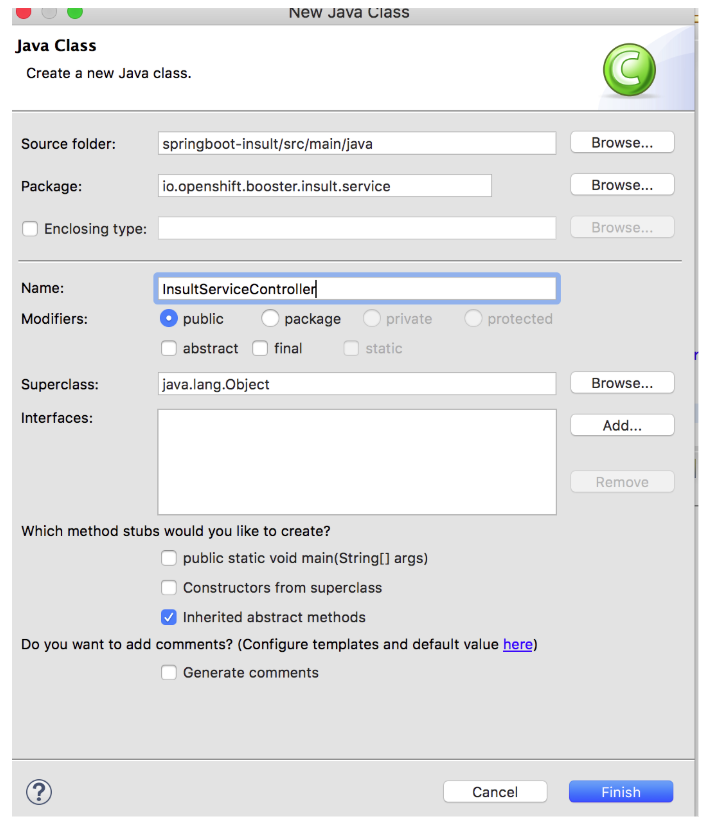  


Here is the code for InsultServiceController  


```java
package io.openshift.booster.insult.service;

import org.springframework.beans.factory.annotation.Autowired;
import org.springframework.web.bind.annotation.RestController;
import org.springframework.web.bind.annotation.RequestMapping;

import io.openshift.booster.service.GreetingProperties;
import io.openshift.booster.insult.model.Insult;

import io.openshift.booster.*;
@RestController

public class InsultServiceController {
    
	@Autowired
	private GreetingProperties properties;
	@Autowired
	private final AdjectiveService adjService;
	@Autowired
	private final NounService nounService;
	
	public InsultServiceController(final AdjectiveService aService,final NounService nService)
	{
		adjService=aService;
		nounService=nService;
	}

	@RequestMapping("/api/insult")
	public Insult doGet() {
		 
		System.out.println("insult called=");
		 String adj=adjService.getAdjective();
		 System.out.println("adj returned="+adj);
		 
		 
		 
		 String noun=nounService.getNoun();
		 
		 System.out.println("Adjective="+adj);
		 System.out.println("Noun="+noun);
		 
		return new Insult(adj+noun);
	}
}
```


Thats it - we are done. Let’s quickly deploy the app to openshift


#### Deploy the service to Openshift 
Step 1: right click -> ‘Run As’ ->Run Configuration ->Select maven profile ‘springboot-insult’ and hit ‘Run’  

You should see the build success message as follows  

Select new configuration on the left top corner, give details as follows  


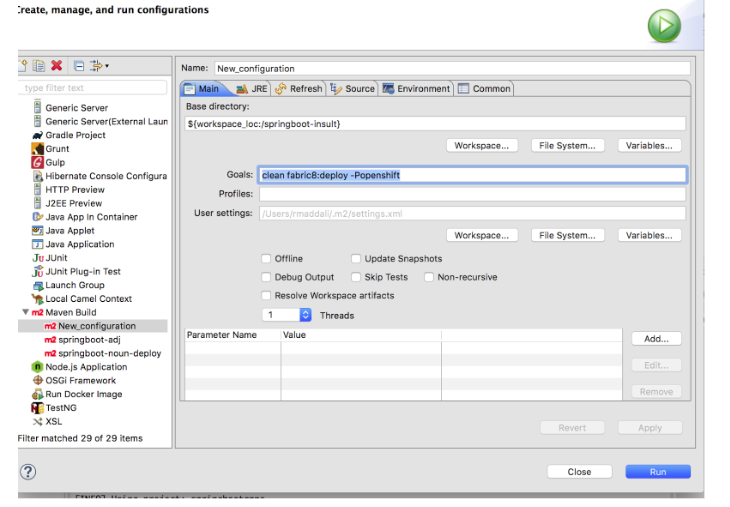  


You should see a maven build successful message  


Access the application under following URL and hit ‘Invoke’  

http://springboot-insult-springbootapps.192.168.64.2.nip.io/  

  


#### Unit Testing 

You should see following auto generated test classes for all the 3 rest services we created above. Let's Examine springboot-insult service.  

  

Step1: Open LocalTest.java and copy below code  


```java
/*
 * Copyright 2016-2017 Red Hat, Inc, and individual contributors.
 *
 * Licensed under the Apache License, Version 2.0 (the "License");
 * you may not use this file except in compliance with the License.
 * You may obtain a copy of the License at
 *
 * http://www.apache.org/licenses/LICENSE-2.0
 *
 * Unless required by applicable law or agreed to in writing, software
 * distributed under the License is distributed on an "AS IS" BASIS,
 * WITHOUT WARRANTIES OR CONDITIONS OF ANY KIND, either express or implied.
 * See the License for the specific language governing permissions and
 * limitations under the License.
 */
package io.openshift.booster;

import org.junit.Before;
import org.junit.runner.RunWith;
import org.springframework.beans.factory.annotation.Autowired;
import org.springframework.beans.factory.annotation.Value;
import org.springframework.boot.test.context.SpringBootTest;
import org.springframework.http.HttpMethod;
import org.springframework.http.HttpStatus;
import org.springframework.http.MediaType;
import org.springframework.test.context.junit4.SpringRunner;
import org.springframework.test.web.client.MockRestServiceServer;
import org.springframework.test.web.client.match.MockRestRequestMatchers;
import org.springframework.test.web.client.response.MockRestResponseCreators;
import org.springframework.web.client.RestTemplate;

import com.jayway.restassured.RestAssured;

import io.openshift.booster.service.GreetingProperties;

@RunWith(SpringRunner.class)
@SpringBootTest(webEnvironment = SpringBootTest.WebEnvironment.RANDOM_PORT)
public class LocalTest extends AbstractBoosterApplicationTest {

    @Value("${local.server.port}")
    private int port;

    @Autowired
    private GreetingProperties properties;
    
    @Autowired
	 private  RestTemplate restTemplate;

    @Before
    public void beforeTest() {
        RestAssured.baseURI = String.format("http://localhost:%d/api/insult", port);
        
       
        		 MockRestServiceServer server = MockRestServiceServer.bindTo(restTemplate).build();

//        		 server.expect(1, RequestResultMatchers.)
//        		     .andRespond(withSuccess("{ \"id\" : \"42\", \"name\" : \"Holiday Inn\"}", MediaType.APPLICATION_JSON));
        
        		 server.expect(MockRestRequestMatchers.requestTo("http://springboot-adj:8080/api/adjective"))
        		 .andExpect(MockRestRequestMatchers.method(HttpMethod.GET))
        		 .andRespond(
        				 MockRestResponseCreators.withStatus(HttpStatus.OK)
        				 .contentType(MediaType.APPLICATION_JSON).body("{ \"id\" : \"42\", \"name\" : \"Holiday Inn\"}"));
        		;
        		server.expect(MockRestRequestMatchers.requestTo("http://springboot-noun:8080/api/noun"))
       		 .andExpect(MockRestRequestMatchers.method(HttpMethod.GET))
       		 .andRespond(
       				 MockRestResponseCreators.withStatus(HttpStatus.OK)
       				 .contentType(MediaType.APPLICATION_JSON).body("{ \"id\" : \"42\", \"name\" : \"Holiday Inn\"}"));
       		;
    }

    protected GreetingProperties getProperties() {
        return properties;
    }

}
```


Step2: Because springboot-insult service is calling other rest services (adjective, noun) we are mocking those response in the above code.  

Open AbstractBoosterApplicationTest.java and copy the below code  

```java
/*
 * Copyright 2016-2017 Red Hat, Inc, and individual contributors.
 *
 * Licensed under the Apache License, Version 2.0 (the "License");
 * you may not use this file except in compliance with the License.
 * You may obtain a copy of the License at
 *
 * http://www.apache.org/licenses/LICENSE-2.0
 *
 * Unless required by applicable law or agreed to in writing, software
 * distributed under the License is distributed on an "AS IS" BASIS,
 * WITHOUT WARRANTIES OR CONDITIONS OF ANY KIND, either express or implied.
 * See the License for the specific language governing permissions and
 * limitations under the License.
 */
package io.openshift.booster;

import io.openshift.booster.service.GreetingProperties;
import org.junit.Test;

import com.jayway.restassured.http.ContentType;

import static com.jayway.restassured.RestAssured.given;
import static com.jayway.restassured.RestAssured.when;
import static org.hamcrest.core.Is.is;

public abstract class AbstractBoosterApplicationTest {

    @Test
    public void testGreetingEndpoint() {
    	
   
        when().get()
                .then()
                .statusCode(200)
                .assertThat().contentType(ContentType.JSON);
                
                
                
    }

   

    protected abstract GreetingProperties getProperties();

}
```


Running the unit test cases  

Step1: Rightclick on ‘LocalTest’ and Run as ‘Junit’  


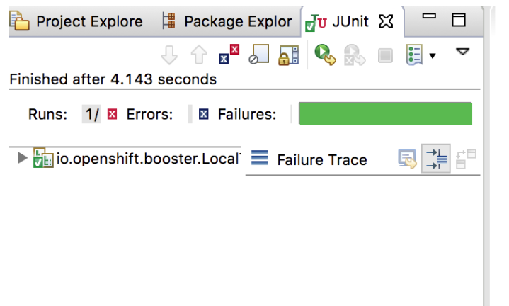  


You should the test case run success as above


#### Integration Testing  

Open OpenShiftIT.java class   


We will be creating two test methods using Arquillian which is an integration testing platform that executes the tests inside openshift.   


```java
/*
 * Copyright 2016-2017 Red Hat, Inc, and individual contributors.
 *
 * Licensed under the Apache License, Version 2.0 (the "License");
 * you may not use this file except in compliance with the License.
 * You may obtain a copy of the License at
 *
 * http://www.apache.org/licenses/LICENSE-2.0
 *
 * Unless required by applicable law or agreed to in writing, software
 * distributed under the License is distributed on an "AS IS" BASIS,
 * WITHOUT WARRANTIES OR CONDITIONS OF ANY KIND, either express or implied.
 * See the License for the specific language governing permissions and
 * limitations under the License.
 */

package io.openshift.booster;

import java.io.IOException;
import java.net.URL;
import java.util.Objects;

import org.arquillian.cube.kubernetes.annotations.Named;
import org.arquillian.cube.openshift.impl.enricher.AwaitRoute;
import org.arquillian.cube.openshift.impl.enricher.RouteURL;
import org.jboss.arquillian.junit.Arquillian;
import org.jboss.arquillian.test.api.ArquillianResource;
import org.junit.Before;
import org.junit.Test;
import org.junit.runner.RunWith;

import com.jayway.restassured.RestAssured;
import com.jayway.restassured.builder.RequestSpecBuilder;

import io.fabric8.kubernetes.api.model.v3_1.Service;
import io.openshift.booster.service.GreetingProperties;

import static org.assertj.core.api.Assertions.assertThat;
import static com.jayway.restassured.RestAssured.given;
import static org.hamcrest.CoreMatchers.containsString;

@RunWith(Arquillian.class)
public class OpenShiftIT extends AbstractBoosterApplicationTest {

    @AwaitRoute(path = "/health")
    @RouteURL("${app.name}")
    private URL baseURL;
    
    @Named("springboot-insult")
    @ArquillianResource
    Service insultService;

    @Before
    public void setup() throws Exception {
    	System.out.println("bbbbbbbbbbbbbbbbbbb"+baseURL);
        RestAssured.baseURI = baseURL + "api/insult";
    }

    protected GreetingProperties getProperties() {
        return new GreetingProperties();
    }

    
    
    @Test
    public void should_verify_insult_service_should_not_be_null() throws IOException {
        assertThat(insultService).isNotNull();
        assertThat(insultService.getSpec()).isNotNull();
        assertThat(insultService.getSpec().getPorts()).isNotNull();
        assertThat(insultService.getSpec().getPorts()).isNotEmpty();
    }
    
    @Test
    public void should_test_insultservice_entry_endpoint_is_reachable() {
        RequestSpecBuilder requestSpecBuilder = getRequestSpecBuilder();

        given(requestSpecBuilder.build())
                .when().get()
                .then()
                .statusCode(200)
                .body(containsString("adjective"));
    }
    
    
    
    
    
    private RequestSpecBuilder getRequestSpecBuilder() {
        RequestSpecBuilder requestSpecBuilder = new RequestSpecBuilder();
        requestSpecBuilder.setBaseUri(String.format("http://%s/api/insult/", Objects.requireNonNull(baseURL).getHost()));
        return requestSpecBuilder;
    }
}

```


Please review should_test_insultservice_entry_endpoint_is_reachable() and should_verify_insult_service_should_not_be_null() test methods.  


Running the testing: Use following maven command to run the tests  

Mvn clean fabric8:deploy -Popenshift,openshift-it  


  


You should see a success message along with the test case results as follows  


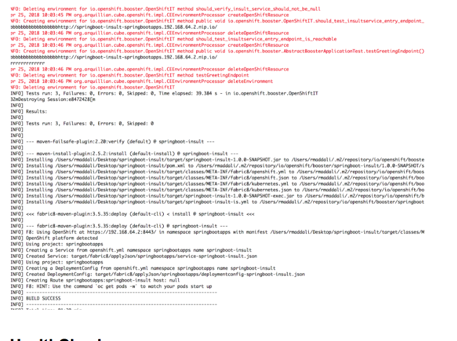  


#### HealthCheck

When you deploy an application, its important to know if it is available and if it can start handling incoming requests. Implementing the health check pattern allows you to monitor the health of an application, which includes if an application is available and whether it is able to service requests.  

http://springboot-insult-springbootapps.192.168.64.2.nip.io/health endpoint would give you UP or DOWN status  


  


When you deploy an application, its important to know if it is available and if it can start handling incoming requests. Implementing the health check pattern allows you to monitor the health of an application, which includes if an application is available and whether it is able to service requests.  
In order to understand the health check pattern, you need to first understand the following concepts:  
#### Liveness  
Liveness defines whether an application is running or not. Sometimes a running application moves into an unresponsive or stopped state and needs to be restarted. Checking for liveness helps determine whether or not an application needs to be restarted.  
#### Readiness  
Readiness defines whether a running application can service requests. Sometimes a running application moves into an error or broken state where it can no longer service requests. Checking readiness helps determine whether or not requests should continue to be routed to that application.  
#### Fail-over  
Fail-over enables failures in servicing requests to be handled gracefully. If an application fails to service a request, that request and future requests can then fail-over or be routed to another application, which is usually a redundant copy of that same application.  
#### Resilience and Stability  
Resilience and Stability enable failures in servicing requests to be handled gracefully. If an application fails to service a request due to connection loss, in a resilient system that request can be retried after the connection is re-established.  
#### Probe  
A probe is a Kubernetes action that periodically performs diagnostics on a running container.  
The purpose of this use case is to demonstrate the health check pattern through the use of probing. Probing is used to report the liveness and readiness of an application. In this use case, you configure an application which exposes an HTTP health endpoint to issue HTTP requests. If the container is alive, according to the liveness probe on the health HTTP endpoint, the management platform receives 200 as return code and no further action is required. If the health HTTP endpoint does not return a response, for example if the thread is blocked, then the application is not considered alive according to the liveness probe. In that case, the platform kills the pod corresponding to that application and recreates a new pod to restart the application.  
This use case also allows you to demonstrate and use a readiness probe. In cases where the application is running but is unable to handle requests, such as when the application returns an HTTP 503 response code during restart, this application is not considered ready according to the readiness probe. If the application is not considered ready by the readiness probe, requests are not routed to that application until it is considered ready according to the readiness probe.  


Step 1: Create class  

Name: TomcatShutdown.java   
Package: io.openshift.booster.health.service  


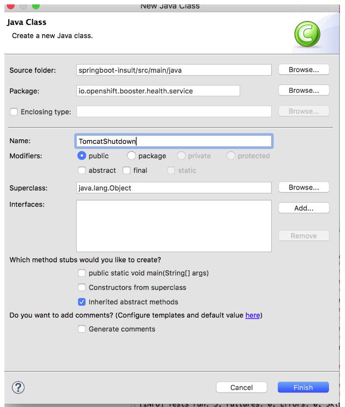  


```java
package io.openshift.booster.health.service;

import org.apache.catalina.Context;
import org.apache.catalina.LifecycleException;
import org.springframework.stereotype.Component;

@Component
public class TomcatShutdown {

	
	private Context context;

    public void setContext(Context context) {
        this.context = context;
    }

    public void shutdown() {
        if (context == null) {
            System.out.println("Tomcat context was not registered. Stopping JVM instead.");
            System.exit(0);
        }

        try {
            System.out.println("Stopping Tomcat context.");
            context.stop();
        } catch (LifecycleException e) {
            System.out.println("Error when stopping Tomcat context. Stopping JVM instead.");
            System.exit(0);
        }
    }
}
```


Step 2: Create class  


Name: ShutdownController.java   
Package: io.openshift.booster.health.service  


```java
package io.openshift.booster.adjective.health.service;
import javax.ws.rs.GET;
import javax.ws.rs.Path;

import org.springframework.beans.factory.annotation.Autowired;
import org.springframework.http.MediaType;
import org.springframework.stereotype.Component;
import org.springframework.web.bind.annotation.GetMapping;
import org.springframework.web.bind.annotation.RequestMapping;
import org.springframework.web.bind.annotation.RestController;

@Path("/")
@Component
public class ShutdownController {

	private final TomcatShutdown tomcatShutdown;

    @Autowired
    public ShutdownController(TomcatShutdown tomcatShutdown) {
        this.tomcatShutdown = tomcatShutdown;
    }
    @GET
    @Path("/stop")
    @GetMapping(produces = MediaType.APPLICATION_JSON_VALUE)
    public String shutdown() throws Exception {
        tomcatShutdown.shutdown();
        return "Shutting down springboot instance..";
    }
}

```


Step 3: Deploy the app using   

Deploy the service to Openshift   
Step 1: right click -> ‘Run As’ ->Run Configuration ->Select maven profile ‘springboot-insult’ and hit ‘Run’  

You should see the build success message as follows  


  


Once you see the success message, go to the next step  


Step 4: Interacting with the application  

http://springboot-insult-springbootapps.192.168.64.2.nip.io/  

Above URL you would be able to invoke the service and get the response.   

Now, We will mimic an error in the app so that application doesn’t respond. Please hit below URL which sends a shutdown signal to tomcat instance.  


http://springboot-insult-springbootapps.192.168.64.2.nip.io/api/stop  


Please open console and you should be see a container restart because the http://springboot-insult-springbootapps.192.168.64.2.nip.io/health   
Health check endpoint returns down and OpenShift restart the container to get in to healthy state. This demonstrates self healing capabilities of openshift and health checks  


#### Circuit Breaker   


The Circuit Breaker is a pattern intended to mitigate the impact of network failure and high latency on service architectures where services synchronously invoke other services. In such cases, if one of the services becomes unavailable due to network failure or incurs unusually high latency values due to overwhelming traffic, other services attempting to call its endpoint may end up exhausting critical resources in an attempt to reach it, rendering themselves unusable. This condition is also known as cascading failure and can render the entire microservice architecture unusable.  
Essentially, the Circuit Breaker acts as a proxy between a protected function and a remote function, which monitors for failures. Once the failures reach a certain threshold, the circuit breaker trips, and all further calls to the circuit breaker return with an error or a predefined fallback response, without the protected call being made at all. The Circuit Breaker usually also contain an error reporting mechanism that notifies you when the Circuit Breaker trips.  
#### Why Circuit Breaker is Important  
In an architecture where multiple services depend on each other for functionality, a failure in one service can rapidly propagate to its dependent services, causing the entire architecture to collapse. Implementing a Circuit Breaker pattern helps prevent this. With the Circuit Breaker pattern implemented, a service client invokes a remote service endpoint via a proxy at regular intervals. If the calls to the remote service endpoint fail repeatedly and consistently, the Circuit Breaker trips, making all calls to the service fail immediately over a set timeout period and returns a predefined fallback response. When the timeout period expires, a limited number of test calls are allowed to pass through to the remote service to determine whether it has healed, or remains unavailable. If these test calls fail, the Circuit Breaker keeps the service unavailable and keeps returning the fallback responses to incoming calls. If the test calls succeed, the Circuit Breaker closes, fully enabling traffic to reach the remote service again.  

Step1: Add following dependency to pom.xml

```
<dependency>
      <groupId>org.springframework.cloud</groupId>
      <artifactId>spring-cloud-starter-netflix-hystrix</artifactId>
    </dependency>
```


Step 2: Open AdjectiveService.java and add following annotations on getAdjective() method  


```
@HystrixCommand(commandKey = "AdjectiveService", fallbackMethod = "getFallbackAdjective", commandProperties = {
		      @HystrixProperty(name = "execution.isolation.thread.timeoutInMilliseconds", value = "100")
	 })
```


Step 3: Add a fallback method as below  
```
 private String getFallbackAdjective() {
 	    return "Fallback:Default msg";
 	  }
```


Step 4: install hystrix dashboard using OC command   
```
oc create -f http://repo1.maven.org/maven2/io/fabric8/kubeflix/hystrix-dashboard/1.0.28/hystrix-dashboard-1.0.28-openshift.yml  
oc expose service hystrix-dashboard --port=8080  
```

Step 5: @EnableCircuitBreaker on io.openshift.booster.BoosterApplication and import the following class   
```
import org.springframework.cloud.client.circuitbreaker.EnableCircuitBreaker;
```


Step 6:  Accessing the application   

http://springboot-insult-springbootapps.192.168.64.2.nip.io/  

Step 7: Scale Down the adjective service pod by using down arrow   


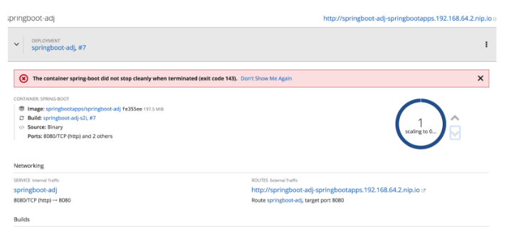  


Step 6:  Accessing the application again, should see Fallback message as below  


http://springboot-insult-springbootapps.192.168.64.2.nip.io/  

  


Step 7: Access hystrix ui  

http://springboot-insult-springbootapps.192.168.64.2.nip.io/hystrix.stream  

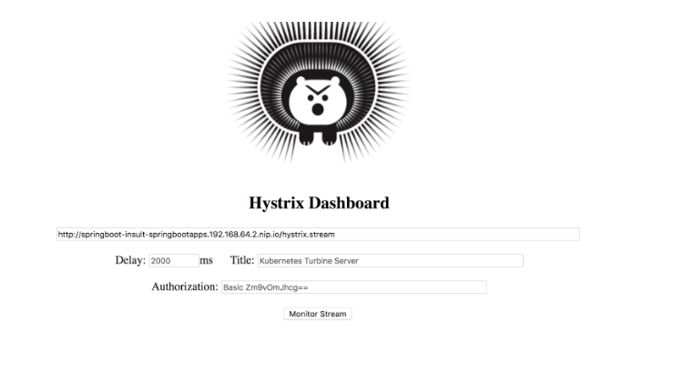  


