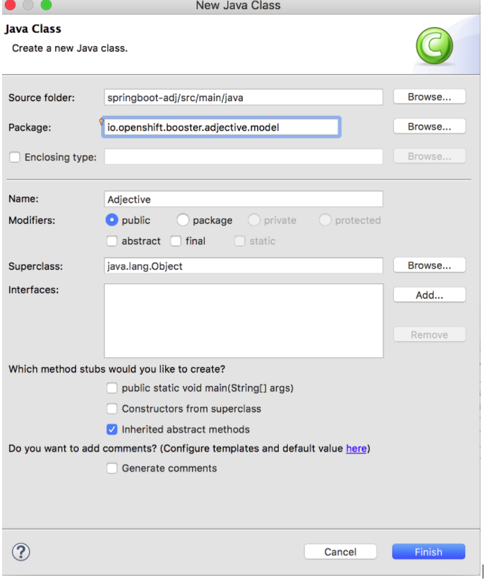
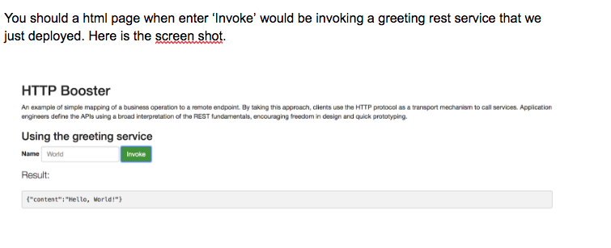
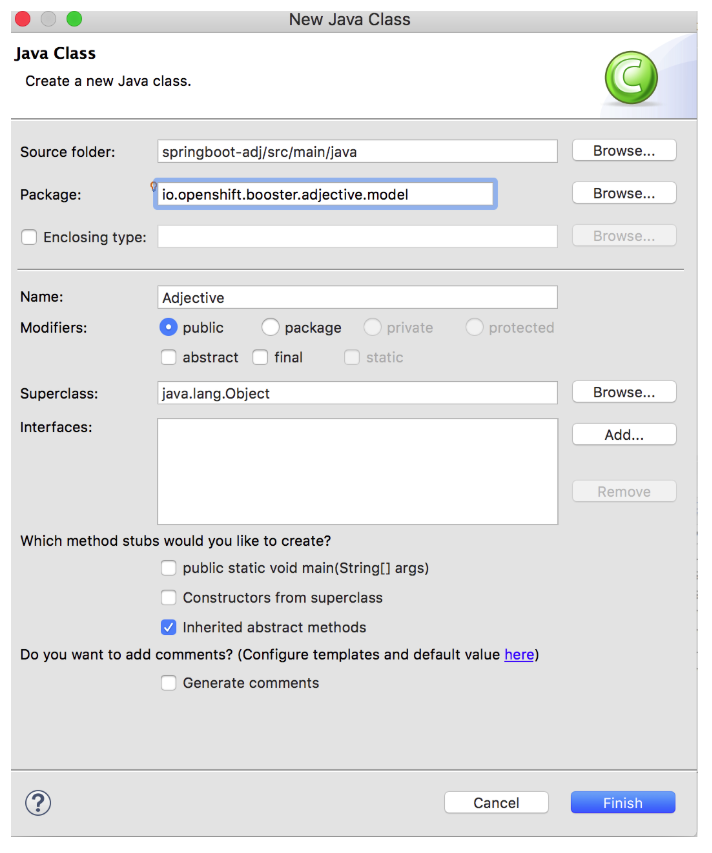

## Lab 1:  Creating SpringBoot Rest Services

In this lab we will create 3 rest services based on SpringBoot
* Creating SpringBoot Rest Services  
	* Adjective Service  
	* Noun Service  
	* Insult Service  
* Service Discovery  
* Unit testing -  RestAssured  
* Integration testing -Arquillian Cube  
* Health Check and Service Healing  
* Circuit Breaker   


### Pre-requisites 

Must have completed labs 1-3. We will be using those components for following labs

### Description

The idea of this lab is to generate to random noun and an adjective to generate an insult. It is based on the following idea:  
http://www.literarygenius.info/a1-shakespearean-insults-generator.htm  

### Steps

1. Create a new project in OpenShift
2. Clone or download the sample project from Github.
3. Add the necessary functionality to return adjectives

The project we use will be based on the REST level 0 example application from OpenShift Launcher.  You can find OpenShift Launcher at https://launch.openshift.io 


### Create a new project in OpenShift

Log into your OpenShift console if you haven't already.  Create a new project from the blue, "Create Project" button on the top right of the screen.  Our example uses the name, "red-hat-summit-2019."

  
  
  


#####  Clone the repository 

`git clone https://github.com/jeremyrdavis/smart-appliance.git`

##### Download the project zip file

Download the zip file from Github by opening https://github.com/jeremyrdavis/smart-appliance-zip
and choosing, "Download ZIP" from the green, "Clone or Download" button

  


##### Import the app into VS Code

Open Visual Studio Code, choose "Open," and navigate to the root folder of the project


##### Build the app

We will use Maven to build our app.  Open a new Terminal either from the command line or within Visual Studio Code by choosing, "Terminal -> New Terminal"


```
mvn clean package
```

The tests should all complete successfully, and you should see a success message.

  

  


#### Deploying to OpenShift  

##### Building a Docker container for OpenShift

We will use the Fabric8 Maven Plugin to deploy our application to OpenShift.  The fabric8 plugin is already part of your pom.xml.  Check out lines 214-226:

```
          <plugin>
            <groupId>io.fabric8</groupId>
            <artifactId>fabric8-maven-plugin</artifactId>
            <executions>
              <execution>
                <id>fmp</id>
                <goals>
                  <goal>resource</goal>
                  <goal>build</goal>
                </goals>
              </execution>
            </executions>
          </plugin>

```

You can read more about the Fabric8 project here, http://fabric8.io/


##### Log in to OpenShift

Fabric8 will build a Docker container and deploy it to OpenShift for us, but we need to be logged in first.  From your OpenShift console copy the login command by clicking on your name in the top right and choosing, "Copy Login Command."

  

Paste and enter the command into your terminal

  


##### Build and deploy to OpenShift

Now we can deploy our app.  From the terminal run the following maven command:

```
mvn clean fabric8:deploy -Popenshift  
```

This build will take longer because we are building Docker containers in addition to our Spring Boot application.  When the build and push to OpenShift is complete you will see a success message similar to the following:

```
[INFO] F8: HINT: Use the command `oc get pods -w` to watch your pods start up
[INFO] ------------------------------------------------------------------------
[INFO] BUILD SUCCESS
[INFO] ------------------------------------------------------------------------
[INFO] Total time:  06:40 min
[INFO] Finished at: 2019-04-24T12:49:12-04:00
[INFO] ------------------------------------------------------------------------
```

  

  


##### Validating the deployment:  

1. Login to OpenShift Console - with user admin/admin
2. Click on Project ‘red-hat-summit-2019’ if you are not already in that project
3. You should see 1 running pod and a url that you can access
4. Try the url


  


You should see:


  


###  Create Adjective Rest Service

Now that we got an understanding on how build and deploy works, lets create a new service for returning list of adjectives.  Of course, the first step should always be a test...

#### Create a JUnit Test for our endpoint

1. 

Enter the following content:

```java
package io.openshift.booster;

import static io.restassured.RestAssured.given;
import static org.hamcrest.core.Is.is;
import static org.mockito.ArgumentMatchers.isNotNull;

import org.junit.Test;
import org.junit.runner.RunWith;
import org.springframework.beans.factory.annotation.Value;
import org.springframework.boot.test.context.SpringBootTest;
import org.springframework.test.context.junit4.SpringRunner;

@RunWith(SpringRunner.class)
@SpringBootTest(webEnvironment = SpringBootTest.WebEnvironment.RANDOM_PORT)
public class AdjectiveEndpointTest  extends AbstractBoosterApplicationTest{

    private static final String ENDPOINT_PATH = "api/adjective";

    @Value("${local.server.port}")
    private int port;

    @Test
    public void testAdjectiveEndpoint() {
        given()
           .baseUri(baseURI())
           .get(ENDPOINT_PATH)
           .then()
           .statusCode(200)
           .body(isNotNull());
    }

    @Override
    protected String baseURI() {
        return String.format("http://localhost:%d", port);
    }
}
```

#### Create Adjective Model Class  

1. File->New->Class.  
2. Enter package name - io.openshift.booster.adjective.model  
3. Class Name: Adjective  

 


 


#### Now that we got an understanding on how build and deploy works, lets create a new service for returning list of adjectives  


Create Adjective Model Class  
Step1: File->New->Class.  
Step2: Enter package name - io.openshift.booster.adjective.model  
Step3: Class Name: Adjective  


 


```java
package io.openshift.booster.adjective.model;

import java.util.Objects;

public class Adjective {

	
	private String adjective;

    public Adjective() {
    }

    public Adjective(String adjective) {
        this.adjective = adjective;
    }

    public String getAdjective() {
        return adjective;
    }

    public Adjective adjective(String adjective) {
        this.adjective = adjective;
        return this;
    }

    @Override
    public boolean equals(Object o) {
        if (this == o) return true;
        if (o == null || getClass() != o.getClass()) return false;
        Adjective adjective1 = (Adjective) o;
        return Objects.equals(adjective, adjective1.adjective);
    }

    @Override
    public int hashCode() {
        return Objects.hash(adjective);
    }

    @Override
    public String toString() {
        final StringBuffer sb = new StringBuffer("Adjective{");
        sb.append("adjective='").append(adjective).append('\'');
        sb.append('}');
        return sb.toString();
    }
	
}
```


#### Create Adjective Spring Rest Service  

Step1: File->New->Class  
Step2: Enter package name - io.openshift.booster.adjective.service  
Step3: Class Name: AdjectiveServiceController  


 


Step4: Here is the code for AdjectiveServiceController.


```java
/*
 * Copyright 2016-2017 Red Hat, Inc, and individual contributors.
 *
 * Licensed under the Apache License, Version 2.0 (the "License");
 * you may not use this file except in compliance with the License.
 * You may obtain a copy of the License at
 *
 * http://www.apache.org/licenses/LICENSE-2.0
 *
 * Unless required by applicable law or agreed to in writing, software
 * distributed under the License is distributed on an "AS IS" BASIS,
 * WITHOUT WARRANTIES OR CONDITIONS OF ANY KIND, either express or implied.
 * See the License for the specific language governing permissions and
 * limitations under the License.
 */
package io.openshift.booster.adjective.service;

import java.io.BufferedReader;
import java.io.InputStream;
import java.io.InputStreamReader;
import java.util.ArrayList;
import java.util.List;
import java.util.Random;

import javax.annotation.PostConstruct;
import javax.ws.rs.GET;
import javax.ws.rs.Path;
import javax.ws.rs.Produces;

import org.springframework.core.io.ClassPathResource;
import org.springframework.core.io.Resource;
import org.springframework.stereotype.Component;

import io.openshift.booster.adjective.model.Adjective;

@Path("/")
@Component
public class AdjectiveServiceController {
    
    private List<Adjective> adjectives = new ArrayList<>();


    

    
    
    
    @GET
    @Path("/adjective")
    @Produces("application/json")
    public Adjective getAdjective() {
       
    	System.out.println(" called"+adjectives.size());
    	
        return adjectives.get(new Random().nextInt(adjectives.size()));
    }
    
    
    @PostConstruct
    public void init() {
        
    	
    	try {
            System.out.println("init called");
    		
    		
    		Resource resource = new ClassPathResource("adjectives.txt");
    		InputStream is = resource.getInputStream();
            if (is != null) {
                BufferedReader reader = new BufferedReader(new InputStreamReader(is));
                reader.lines()
                        .forEach(adj -> adjectives.add(new Adjective(adj.trim())));
            }
        } catch (Exception e) {
            e.printStackTrace();
        }
    	
    }
}

```


Create a adjective text file 


Step1: File->New -> File under src/main/resources

Step2: name of file: adjectives.txt

Step 3: Once the file is created, paste the following content 

```
artless
base-court
bawdy
bat-fowling
beslubbering
beef-witted
bootless
beetle-headed
churlish
boil-brained
cockered
clapper-clawed
clouted
clay-brained
craven
common-kissing
currish
crook-pated
dankish
dismal-dreaming
dissembling
dizzy-eyed
droning
doghearted
errant
dread-bolted
fawning
earth-vexing
fobbing
elf-skinned
froward
fat-kidneyed
frothy
fen-sucked
gleeking
flap-mouthed
goatish
fly-bitten
gorbellied
folly-fallen
impertinent
fool-born
infectious
full-gorged
jarring
guts-griping
loggerheaded
half-faced
lumpish
hasty-witted
mammering
hedge-born
mangled
hell-hated
mewling
idle-headed
paunchy
ill-breeding
pribbling
ill-nurtured
puking
knotty-pated
puny
milk-livered
qualling
motley-minded
rank
onion-eyed
reeky
plume-plucked
roguish
pottle-deep
ruttish
pox-marked
saucy
reeling-ripe
spleeny
rough-hewn
spongy
rude-growing
surly
rump-fed
tottering
shard-borne
unmuzzled
sheep-biting
vain
spur-galled
venomed
swag-bellied
villainous
tardy-gaited
warped
tickle-brained
wayward
toad-spotted
weedy
unchin-snouted
yeasty
weather-bitten
cullionly
whoreson
fusty
malmsey-nosed
caluminous
rampallian
wimpled
lily-livered
burly-boned
scurvy-valiant
misbegotten
brazen-faced
odiferous
unwash'd
poisonous
bunch-back'd
fishified
leaden-footed
wart-necked
muddy-mettled
pigeon-liver'd
scale-sided
```

File is located here for review

https://raw.githubusercontent.com/rmaddali/summit-cloudnative-workshop/master/springboot-adjective-service/src/main/resources/adjectives.txt


Edit index.html file ( under src/main/resources/static folder)

```
<html>
<head>
    <meta charset="utf-8">
    <title>API Level 0 Mission - Spring Boot</title>
    <link rel="stylesheet" href="https://maxcdn.bootstrapcdn.com/bootstrap/3.3.7/css/bootstrap.min.css"
          integrity="sha384-BVYiiSIFeK1dGmJRAkycuHAHRg32OmUcww7on3RYdg4Va+PmSTsz/K68vbdEjh4u" crossorigin="anonymous">
</head>

<body>
<div class="container">
    <div class="row">
        <div class="sect1">
<h2 id="_http_booster">HTTP Booster</h2>
<div class="sectionbody">
<div class="paragraph">
<p>Adjective Service Rest Endpoint</p>
</div>
<div class="sect2">
<h3 id="_using_the_greeting_service">Using the Adjective service</h3>

</div>
</div>
</div>

        <form class="form-inline">
            <div class="form-group">
                <label for="name">Name</label>
                <input type="text" class="form-control" id="name" placeholder="World">
            </div>
            <button id="invoke" type="submit" class="btn btn-success">Invoke</button>
        </form>

        <p class="lead">Result:</p>
        <pre><code id="greeting-result">Invoke the service to see the result.</code></pre>
    </div>
</div>

<script src="https://ajax.googleapis.com/ajax/libs/jquery/1.12.4/jquery.min.js"></script>
<script src="https://maxcdn.bootstrapcdn.com/bootstrap/3.3.7/js/bootstrap.min.js"
        integrity="sha384-Tc5IQib027qvyjSMfHjOMaLkfuWVxZxUPnCJA7l2mCWNIpG9mGCD8wGNIcPD7Txa"
        crossorigin="anonymous"></script>

<script>
  $(document).ready(function () {
    $("#invoke").click(function (e) {
      var n = $("#name").val() || "World";
      $.getJSON("/api/adjective?name=" + n, function (res) {
        $("#greeting-result").text(JSON.stringify(res));
      });
      e.preventDefault();
    });
  });
</script>

</body>

</html>

```

Thats it - we are done. Let’s quickly redeploy the app to openshift  


#### Deploy the service to Openshift   
Step 1: right click -> ‘Run As’ ->Run Configuration ->Select maven profile ‘springboot-adj’ and hit ‘Run’  


 

Access the new service at the following location and hit ‘Invoke’ button  

http://springboot-adj-springbootapps.192.168.64.2.nip.io/  


 

### Recap

Our first service is complete!

