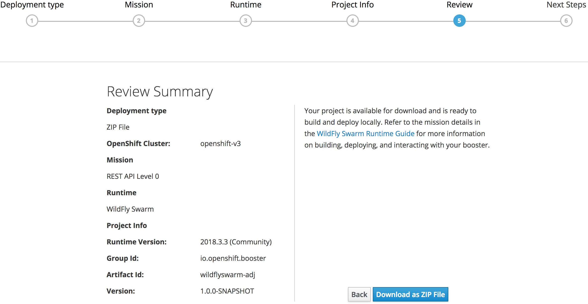
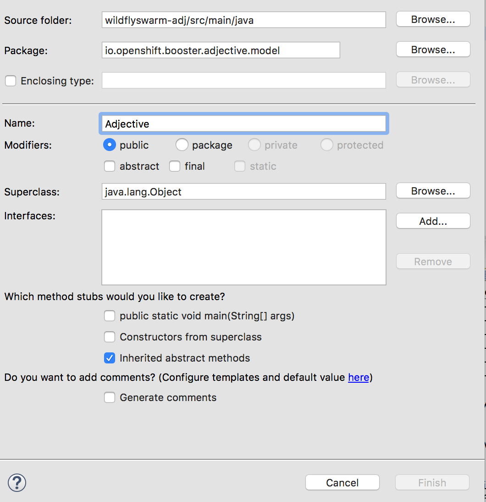
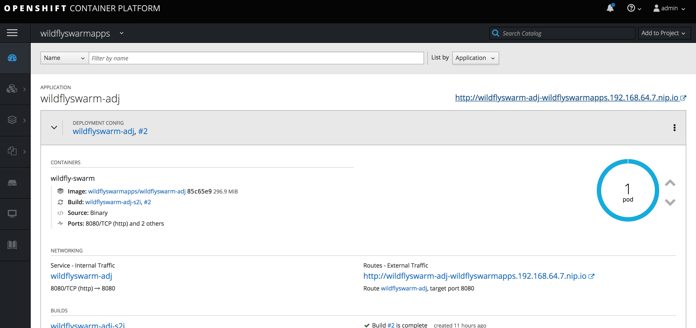
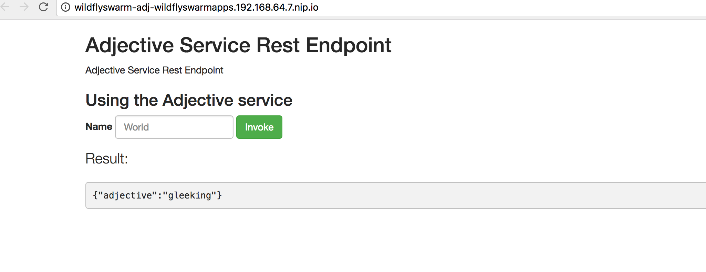

## Lab 5: Creating Wildfly Rest Services 

In this lab we will create 3 microservices. 

* Adjective microservice
* Noun Microservice
* Insult Microservice

Idea is to generate to random noun and an adjective to generate an insult. It is based on the following idea
http://www.literarygenius.info/a1-shakespearean-insults-generator.htm

### Prerequisites
* You should have CDK running
* Launchpad should have been installed on CDK
* JBoss Development Studio as IDE. You got this with JBoss Development Suite
* Apache Maven 3.5+


### Create Project Bundle with Fabric8 Launcher
* Start the Launcher, if you haven't already done so previously.
* Click on ‘Launch Your Project ‘
* Launcher will prompt you to login. You can type in your `developers.redhat.com` credentials to login.
* Select Deployment type  `I will build and run locally`

* Select mission `Rest API Level 0` can click `Next` to continue. Mission Control, as the name suggests, coordinates actions among dependent services. Its responsibility is to take the following inputs:
	* 	A GitHub Project
	* 	A GitHub project	
	* 	A GitHub user (via OAuth token)	
	* 	An OpenShift instance's API URL	
	* 	An OpenShift user (via OAuth token)	

	And performs the following actions:	
	
	* 	Fork the GitHub project into the GitHub user's namespace	
	* Create an OpenShift project	
	* Create a Jenkins Pipeline BuildConfig	
	* Associate the OpenShift project with the newly-forked GitHub repo	
	* Create a GitHub webhook on the newly-forked GitHub project to register push events to the OpenShift project	

* On the next screen select ‘Wildfly Swarm’ as the Runtime and hit ‘ Next’
	

* On the next screen add the following values for the parameters

	* Runtime Version: 2018.3.3 
	* GroupId - io.openshift.booster
	* ArtifactId - wildflyswarm-adj
	* Version - 1.0.0-SNAPSHOT
	

**Note** Please use the above values as we'll be using then throught the lab.

* Review Summary on the next page and press on `Download as Zip File` button.

	

Your application bundle will be downloaded as `wildflyswarm-adj.zip`.

* You should see the next step as shown below
	

### Import Project to JBoss Developer Studio

*  Run the following command to unzip the downloaded project bundle, or you can just double click

```
$ unzip wildflyswarm-adj.zip
```
Note the location of your unzipped file.

* Open JBoss Developer Studio (Redsphere Icon) 
* Choose the following menu options to import the project
`File` ->`Import`-> `Maven` ->`Existing Maven Projects` , `Browse` to the location where the unzipped project is and select the project. (Most likely you may have unzipped it in the `Downloads` folder!!)

* Explore the project i.e, expand `wildflyswarm-adj` project and look at `src/main/java` 

Explore the following auto-generated code (by the launcher):
* GreetingEndpoint.java

```
package io.openshift.booster;

import javax.ws.rs.GET;
import javax.ws.rs.Path;
import javax.ws.rs.Produces;
import javax.ws.rs.QueryParam;

@Path("/")
public class GreetingEndpoint {

    private static final String template = "Hello, %s!";

    @GET
    @Path("/greeting")
    @Produces("application/json")
    public Greeting greeting(@QueryParam("name") String name) {
        String suffix = name != null ? name : "World";
        return new Greeting(String.format(template, suffix));
    }
}

```

* ApplicationConfig is an auto generated class for Resource Entrypoint

```
package io.openshift.booster;

import javax.ws.rs.ApplicationPath;
import javax.ws.rs.core.Application;

/**
 * Resource entry point
 */
@ApplicationPath("/api")
public class ApplicationConfig extends Application {

}
```

Now, let us deploy this application to OpenShift and test it.

### Deploying Application into OpenShift

* Lets first create a project/namespace on openshift where will deploy wildfly swarm based apps. Open a terminal and run the following commands on CLI:

```
$ oc new-project wildflyswarmapps --display-name="wildflyswarmapps" --description="wildflyswarmapps"

```

Now lets deploy our new wildflyswarm-adj app from JBDS.

* Right click on the project `wildflyswarm-adj` ->`Run As` -> `Run Configurations`
	

* Then choose `Maven_Build` -> `New_Configuration` :

	* Name: `wildflyswarm-adj-deploy`	
	* BaseDirectory: `workspace`->`select wildflyswarm-adj`	
	* Goals: `clean fabric8:deploy -Popenshift`
  Then click on `Run`
  
* Watch the build logs in Console tab. The build runs for a couple of minutes, runs test cases,  and you should see the following at the end.


### Validating Application on OpenShift

* Login to OpenShift Console - with user admin/admin
* Click on Project ‘wildflyswarmapps’
* You should see pod running. See below pic for reference


* Click on the route URL on the right corner.
[http://wildflyswarm-adj-wildflyswarmapps.{yourip}/]

You should a html page when enter 'Invoke' would be invoking a greeting rest service that we just deployed. Here is the screen shot.


### Create Adjective Rest Service

Now that we got an understanding on how build and deploy works, lets create a new service for returning list of adjectives


Create Adjective Model Class

* package name: io.openshift.booster.adjective.model
* Class Name: Adjective




Copy paste below class into Adjective class

```java
 
package io.openshift.booster.adjective.model;

import java.util.Objects;

public class Adjective {

private String adjective;

public Adjective() {
}

public Adjective(String adjective) {
this.adjective = adjective;
}

public String getAdjective() {
return adjective;
}

public Adjective adjective(String adjective) {
this.adjective = adjective;
return this;
}

@Override
public boolean equals(Object o) {
if (this == o) return true;
if (o == null || getClass() != o.getClass()) return false;
Adjective adjective1 = (Adjective) o;
return Objects.equals(adjective, adjective1.adjective);
}

@Override
public int hashCode() {
return Objects.hash(adjective);
}

@Override
public String toString() {
final StringBuffer sb = new StringBuffer("Adjective{");
sb.append("adjective='").append(adjective).append('\'');
sb.append('}');
return sb.toString();
}
}
```
Create Adjective Rest Service class(File->New->Class)

package name: io.openshift.booster.adjective.service

Class Name: AdjectiveResource


Copy following code for AdjectiveResource class

```
package io.openshift.booster.adjective.service;

import java.io.BufferedReader;
import java.io.InputStream;
import java.io.InputStreamReader;
import java.util.ArrayList;
import java.util.List;
import java.util.Random;

import javax.annotation.PostConstruct;
import javax.enterprise.context.ApplicationScoped;
import javax.ws.rs.Consumes;
import javax.ws.rs.DELETE;
import javax.ws.rs.GET;
import javax.ws.rs.POST;
import javax.ws.rs.Path;
import javax.ws.rs.PathParam;
import javax.ws.rs.Produces;
import javax.ws.rs.core.MediaType;
import javax.ws.rs.core.Response;


import io.openshift.booster.adjective.model.Adjective;

/**
 * @author Ken Finnigan
 */
@Path("/")
@ApplicationScoped


public class AdjectiveResource {

    private List<Adjective> adjectives = new ArrayList<>();

    @PostConstruct
    public void loadData() {
        try {
            InputStream is = this.getClass().getClassLoader().getResourceAsStream("adjectives.txt");
            if (is != null) {
                BufferedReader reader = new BufferedReader(new InputStreamReader(is));
                reader.lines()
                        .forEach(adj -> adjectives.add(new Adjective(adj.trim())));
            }
        } catch (Exception e) {
            e.printStackTrace();
        }
    }

    @GET
    @Produces(MediaType.APPLICATION_JSON)
    @Path("/adjective")
    public Adjective getAdjective() {
        return adjectives.get(new Random().nextInt(adjectives.size()));
    }

    @POST
    @Consumes(MediaType.APPLICATION_JSON)
    @Produces(MediaType.APPLICATION_JSON)
    public Response addAdjective(Adjective adjective) {
        if (adjectives.contains(adjective)) {
            return Response
                    .status(Response.Status.CONFLICT)
                    .build();
        }

        adjectives.add(adjective);

        return Response
                .status(Response.Status.CREATED)
                .entity(adjective)
                .build();
    }

    @DELETE
    @Path("/{adjective}")
    public Response deleteAdjective(@PathParam("adjective") String adjectiveName) {
        Adjective deletingAdjective = new Adjective(adjectiveName);

        if (!adjectives.contains(deletingAdjective)) {
            return Response
                    .status(Response.Status.NOT_FOUND)
                    .build();
        }

        adjectives.remove(deletingAdjective);

        return Response
                .noContent()
                .build();
    }
}
```
### Create list of adjectives in a text file for our new AdjectiveResource Rest service to return adjectives

File->New -> File under src/main/resources

Name: adjectives.txt

Copy paste below adjectives into adjectives.txt file

```
artless
base-court
bawdy
bat-fowling
beslubbering
beef-witted
bootless
beetle-headed
churlish
boil-brained
cockered
clapper-clawed
clouted
clay-brained
craven
common-kissing
currish
crook-pated
dankish
dismal-dreaming
dissembling
dizzy-eyed
droning
doghearted
errant
dread-bolted
fawning
earth-vexing
fobbing
elf-skinned
froward
fat-kidneyed
frothy
fen-sucked
gleeking
flap-mouthed
goatish
fly-bitten
gorbellied
folly-fallen
impertinent
fool-born
infectious
full-gorged
jarring
guts-griping
loggerheaded
half-faced
lumpish
hasty-witted
mammering
hedge-born
mangled
hell-hated
mewling
idle-headed
paunchy
ill-breeding
pribbling
ill-nurtured
puking
knotty-pated
puny
milk-livered
qualling
motley-minded
rank
onion-eyed
reeky
plume-plucked
roguish
pottle-deep
ruttish
pox-marked
saucy
reeling-ripe
spleeny
rough-hewn
spongy
rude-growing
surly
rump-fed
tottering
shard-borne
unmuzzled
sheep-biting
vain
spur-galled
venomed
swag-bellied
villainous
tardy-gaited
warped
tickle-brained
wayward
toad-spotted
weedy
unchin-snouted
yeasty
weather-bitten
cullionly
whoreson
fusty
malmsey-nosed
caluminous
rampallian
wimpled
lily-livered
burly-boned
scurvy-valiant
misbegotten
brazen-faced
odiferous
unwash'd
poisonous
bunch-back'd
fishified
leaden-footed
wart-necked
muddy-mettled
pigeon-liver'd
scale-sided
```
Edit src/main/webapp/index.html ( home page for our rest service for viewing response from AdjectiveResource rest service)


```
<html>
<head>
    <meta charset="utf-8">
    <title>WildflySwarm- AdjectiveService</title>
    <link rel="stylesheet" href="https://maxcdn.bootstrapcdn.com/bootstrap/3.3.7/css/bootstrap.min.css"
          integrity="sha384-BVYiiSIFeK1dGmJRAkycuHAHRg32OmUcww7on3RYdg4Va+PmSTsz/K68vbdEjh4u" crossorigin="anonymous">
</head>

<body>
<div class="container">
    <div class="row">
        <div class="sect1">
<h2 id="_http_booster">Adjective Service Rest Endpoint</h2>
<div class="sectionbody">
<div class="paragraph">
<p>Adjective Service Rest Endpoint</p>
</div>
<div class="sect2">
<h3 id="_using_the_greeting_service">Using the Adjective service</h3>

</div>
</div>
</div>

        <form class="form-inline">
            <div class="form-group">
                <label for="name">Name</label>
                <input type="text" class="form-control" id="name" placeholder="World">
            </div>
            <button id="invoke" type="submit" class="btn btn-success">Invoke</button>
        </form>

        <p class="lead">Result:</p>
        <pre><code id="greeting-result">Invoke the service to see the result.</code></pre>
    </div>
</div>

<script src="https://ajax.googleapis.com/ajax/libs/jquery/1.12.4/jquery.min.js"></script>
<script src="https://maxcdn.bootstrapcdn.com/bootstrap/3.3.7/js/bootstrap.min.js"
        integrity="sha384-Tc5IQib027qvyjSMfHjOMaLkfuWVxZxUPnCJA7l2mCWNIpG9mGCD8wGNIcPD7Txa"
        crossorigin="anonymous"></script>

<script>
  $(document).ready(function () {
    $("#invoke").click(function (e) {
      var n = $("#name").val() || "World";
      $.getJSON("/api/adjective?name=" + n, function (res) {
        $("#greeting-result").text(JSON.stringify(res));
      });
      e.preventDefault();
    });
  });
</script>

</body>

</html>

```

Add following dependency to pom.xml as we are using CDI in our AdjectiveResource class
```
<dependency>

<groupId>org.wildfly.swarm</groupId>

<artifactId>cdi</artifactId>

</dependency>
```

** Deploy the service to Openshift

right click on the project(wildflyswar-adj) -> 'Run As' ->Run Configuration ->Select maven profile 'wildflyswarm-adj' and hit 'Run'


Successful build message should appear as follows


Access the deployed adjective service by going to OpenShift Console and look for a Route URL 



[http://wildflyswarm-adj-wildflyswarmapps.{**yourip**}/]

You should see the following webpage(index.html) when you access above URL. 

Click on Invoke to see the response from the Adjective Rest service





### Create Noun Rest Service Project Bundle with Fabric8 Launcher
* Start the Launcher, if you haven't already done so previously.
* Click on ‘Launch Your Project ‘
* Launcher will prompt you to login. You can type in your `developers.redhat.com` credentials to login.
* Select Deployment type  `I will build and run locally`

* Select mission `Rest API Level 0` can click `Next` to continue. Mission Control, as the name suggests, coordinates actions among dependent services. Its responsibility is to take the following inputs:
	* 	A GitHub Project
	* 	A GitHub project	
	* 	A GitHub user (via OAuth token)	
	* 	An OpenShift instance's API URL	
	* 	An OpenShift user (via OAuth token)	

	And performs the following actions:	
	
	* 	Fork the GitHub project into the GitHub user's namespace	
	* Create an OpenShift project	
	* Create a Jenkins Pipeline BuildConfig	
	* Associate the OpenShift project with the newly-forked GitHub repo	
	* Create a GitHub webhook on the newly-forked GitHub project to register push events to the OpenShift project	

* On the next screen select ‘Wildfly Swarm’ as the Runtime and hit ‘ Next’
	

* On the next screen add the following values for the parameters

	* Runtime Version: 2018.3.3 
	* GroupId - io.openshift.booster
	* ArtifactId - wildflyswarm-noun
	* Version - 1.0.0-SNAPSHOT


	


* Review the values in Review Screen

	

 * hit 'Download as Zip file', Download should begin on your system
 * Unzip the project

**Import Project into Eclipse**


