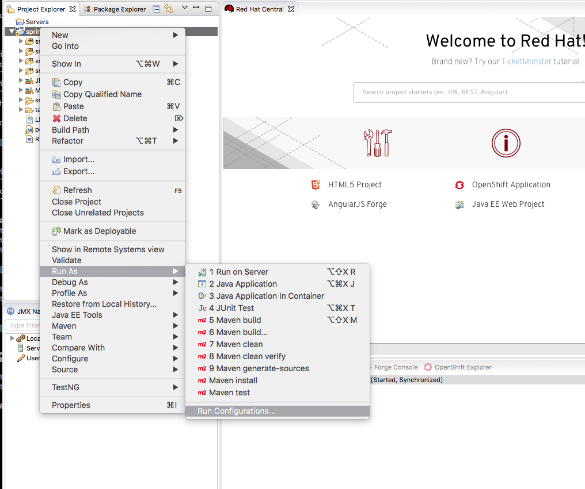
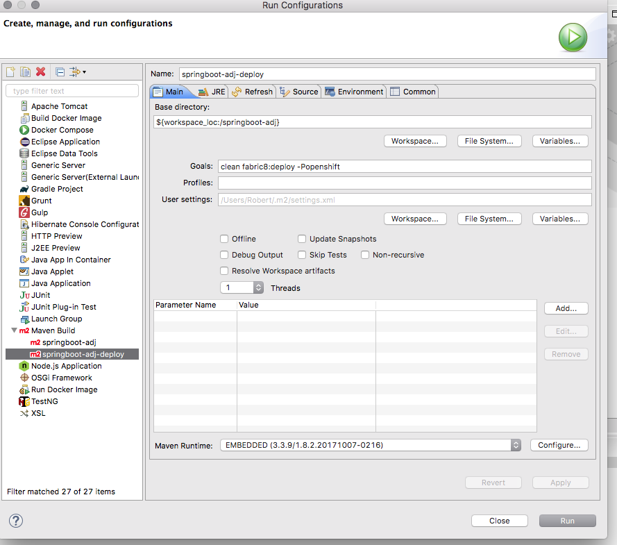

## Creating a Vertx gateway with Circuit Breaker

In this lab we will create 3 microservices in 3 different runtimes supported by Red Hat OpenShift Application Runtimes (RHOAR)

* Create the SpringBoot adjective service
* Create the WildFly Swarm noun service
* Create the Vertx gateway

### Pre-requisites

Must have completed labs 1-3. We will be using those components for following labs

### Description

The idea of this lab is to generate a random noun and an adjective to generate an insult. It is based on the following idea:  
http://www.literarygenius.info/a1-shakespearean-insults-generator.htm  

### Scaffold and Deploy the SpringBoot adjective service

We will be using LaunchPad to scaffold our projects. This will create the structure we will be using.

####  Log into LaunchPad  

You can perform these steps in two different ways by doing from webconsole or direct by using the CLI tool.

First we need to log into the OpenShift Console. You can do so by doing the following on the command line:

```shell
minishift console --url
```

This will give you the url for the console running in your local OpenShift instance.  

Open the **rhoarpad** project and the route link should be listed there:  

  

Or retrieveing the url from `oc` command line.

```shell
oc get routes -n rhoarpad
```

Open the url in the browser.

#### Creating the project template in Lauchpad

1. Click on **Launch Your Project**.
2. Select Deployment Type: **I will build and run locally**.  
3. Select **Rest API Level 0** and hit **Continue**.  

    

4. Select the **Spring Boot** runtime and hit **Next**.
5. Add properties.
6. Update Artifact ID to `springboot-adj`.

      

    > NOTE: Make sure you keep the same application names as we will be referring them as service names later this lab.

7. Summary Screen - Please review carefully and hit **Download as zip**.  
8. Copy the zip file into any directory you choose (we will be using as a workspace) and unzip it.

#### Importing Project into JBoss Developer Studio  

We will import the project template you just created into the IDE and deploy it on OpenShift.

> NOTE - Please ensure you are logged into OpenShift in the `springbootapps` project.

1. Create a new project called `springbootapps`.
```
oc new-project springbootapps
```
2. Make sure your are using the right project.
```
oc project springbootapps
```

    Next step is to update the **Run Configurations** for your maven build. We will add the fabric8 plugin command to deploy into our OpenShift cluster.

    The `fabric8-maven-plugin` is a Maven plugin that accelerates development by allowing easy and quick deployment of Java applications to OpenShift. This plugin reduces the required steps by building the application, creating a docker image and deploying it to OpenShift in a single command, which is especially useful in the development stage, where multiple retries often accompany each step.

3. Right click in the project name and select **Run As -> Run Configurations...**

    

4. Select **Maven Build** in the left menu list.
5. In **Goals** type: `clean fabric8:deploy -Popenshift` and hit **Run**

      

6. You should see a successful deployment at the end of logs.  

    

#### Validating the Deployment

Log into your OpenShift instance and get the url for the service we deployed.

1. Login to OpenShift Console with credentials `admin/admin`.
2. Click on Project `springbootapps`.
3. You should notice that there is a pod running (the blue circle).

    

4. Click in the route URL on the right corner. It sould look similar to this http://springboot-adj-springbootapps.192.168.64.2.nip.io/  

5. You should see the service test page.

    

###  Create Adjective Rest Service

Now that we got an understanding on how build and deploy process works, lets create a new service for returning list of adjectives.

#### Create Adjective Model Class  

Inside JBoss Developer Studio follow:

1. **File** -> **New** -> **Class**.  
2. Enter package name - `io.openshift.booster.adjective.model`  
3. Enter class name: `Adjective`  

    

4. Replace the content by the following:

```java
package io.openshift.booster.adjective.model;

import java.util.Objects;

public class Adjective {


	private String adjective;

    public Adjective() {
    }

    public Adjective(String adjective) {
        this.adjective = adjective;
    }

    public String getAdjective() {
        return adjective;
    }

    public Adjective adjective(String adjective) {
        this.adjective = adjective;
        return this;
    }

    @Override
    public boolean equals(Object o) {
        if (this == o) return true;
        if (o == null || getClass() != o.getClass()) return false;
        Adjective adjective1 = (Adjective) o;
        return Objects.equals(adjective, adjective1.adjective);
    }

    @Override
    public int hashCode() {
        return Objects.hash(adjective);
    }

    @Override
    public String toString() {
        final StringBuffer sb = new StringBuffer("Adjective{");
        sb.append("adjective='").append(adjective).append('\'');
        sb.append('}');
        return sb.toString();
    }

}
```    


#### Create the Adjective Spring resource

Inside JBoss Developer Studio follow:

1. **File** -> **New** -> **Class**.  
2. Enter package name - `io.openshift.booster.adjective.model`  
3. Enter class name: `AdjectiveServiceController`

   

4. Replace the content by the following:

```java
package io.openshift.booster.adjective.service;

import java.io.BufferedReader;
import java.io.InputStream;
import java.io.InputStreamReader;
import java.util.ArrayList;
import java.util.List;
import java.util.Random;

import javax.annotation.PostConstruct;

import org.springframework.web.bind.annotation.RequestMapping;
import org.springframework.web.bind.annotation.RestController;

import io.openshift.booster.adjective.model.Adjective;

@RestController
public class AdjectiveServiceController {

    private List<Adjective> adjectives = new ArrayList<>();

    @RequestMapping("/api/adjective")
    public Adjective getAdjective() {

        return adjectives.get(new Random().nextInt(adjectives.size()));
    }


    @PostConstruct
    public void init() {


    	try {
            InputStream is = this.getClass().getClassLoader().getResourceAsStream("classpath:"+"adjectives.txt");
            if (is != null) {
                BufferedReader reader = new BufferedReader(new InputStreamReader(is));
                reader.lines()
                        .forEach(adj -> adjectives.add(new Adjective(adj.trim())));
            }
        } catch (Exception e) {
            e.printStackTrace();
        }

    }
}
```

#### Create the adjective text file


1. Create a new file **File**->**New**->**File** under `src/main/resources`.

2. Name that file: `adjectives.txt`.

3. Once the file is created, paste the following content:

```
artless
base-court
bawdy
bat-fowling
beslubbering
beef-witted
bootless
beetle-headed
churlish
boil-brained
cockered
clapper-clawed
clouted
clay-brained
craven
common-kissing
currish
crook-pated
dankish
dismal-dreaming
dissembling
dizzy-eyed
droning
doghearted
errant
dread-bolted
fawning
earth-vexing
fobbing
elf-skinned
froward
fat-kidneyed
frothy
fen-sucked
gleeking
flap-mouthed
goatish
fly-bitten
gorbellied
folly-fallen
impertinent
fool-born
infectious
full-gorged
jarring
guts-griping
loggerheaded
half-faced
lumpish
hasty-witted
mammering
hedge-born
mangled
hell-hated
mewling
idle-headed
paunchy
ill-breeding
pribbling
ill-nurtured
puking
knotty-pated
puny
milk-livered
qualling
motley-minded
rank
onion-eyed
reeky
plume-plucked
roguish
pottle-deep
ruttish
pox-marked
saucy
reeling-ripe
spleeny
rough-hewn
spongy
rude-growing
surly
rump-fed
tottering
shard-borne
unmuzzled
sheep-biting
vain
spur-galled
venomed
swag-bellied
villainous
tardy-gaited
warped
tickle-brained
wayward
toad-spotted
weedy
unchin-snouted
yeasty
weather-bitten
cullionly
whoreson
fusty
malmsey-nosed
caluminous
rampallian
wimpled
lily-livered
burly-boned
scurvy-valiant
misbegotten
brazen-faced
odiferous
unwash'd
poisonous
bunch-back'd
fishified
leaden-footed
wart-necked
muddy-mettled
pigeon-liver'd
scale-sided
```

#### Deploy the service to OpenShift
