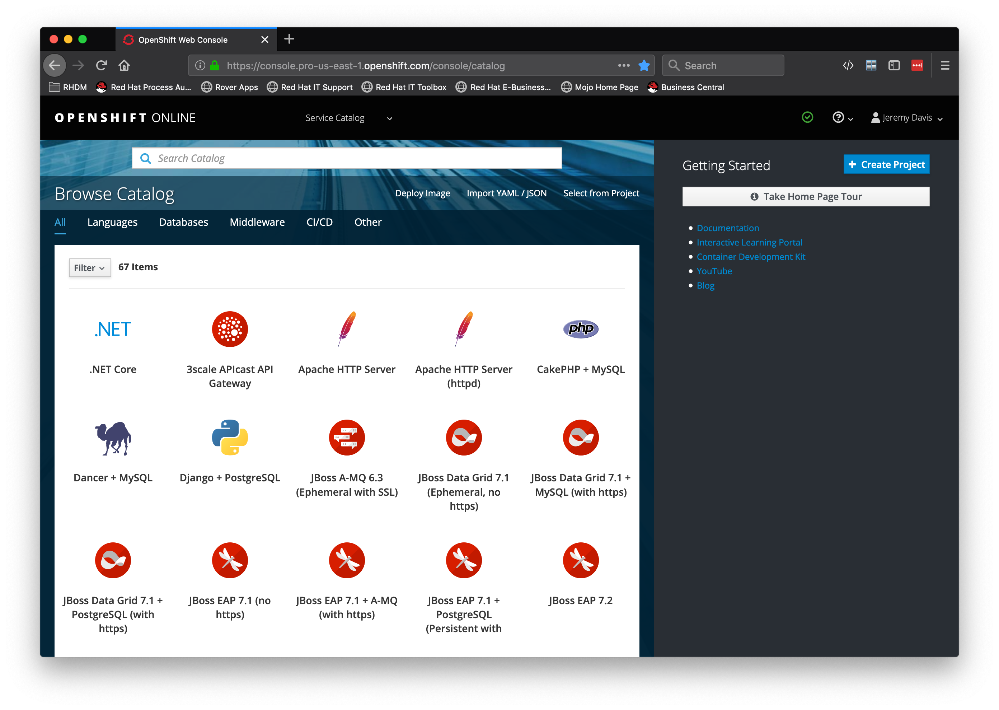
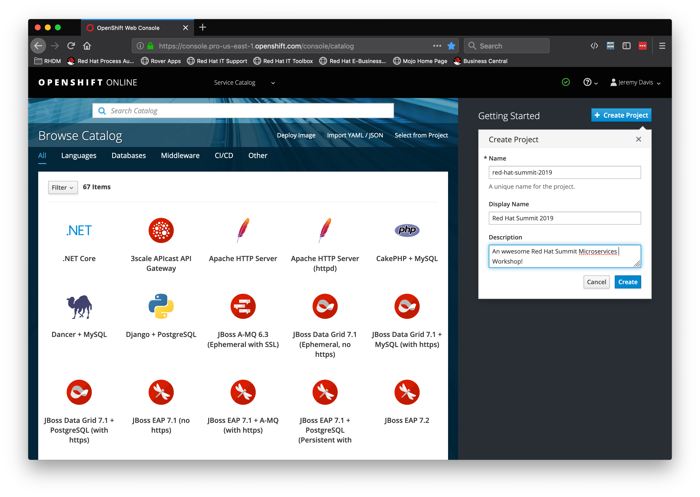

# Lab 3:  Creating a Vert.x Adjective Services

## Pre-requisites 

Must have completed labs 1-3. We will be using those components for following labs

## Description

The idea of this lab is to generate to random noun and an adjective to generate an insult. It is based on the following idea:  
http://www.literarygenius.info/a1-shakespearean-insults-generator.htm  

## Steps

1. Create a new project in OpenShift (if you haven't already)
2. Clone or download the sample project from Github
3. Add the necessary functionality to return adjectives

The project we use will be based on the REST level 0 example application from OpenShift Launcher.  You can find OpenShift Launcher at https://launch.openshift.io 


## Create a new project in OpenShift

Log into your OpenShift console if you haven't already.  Create a new project from the blue, "Create Project" button on the top right of the screen.  Our example uses the name, "red-hat-summit-2019."

  
  
  


##  Clone or download the repository 

```bash

git clone https://github.com/jeremyrdavis/insult-starter-vertx.git

```

Download the zip file from Github by opening https://github.com/jeremyrdavis/insult-starter-vertx
and choosing, "Download ZIP" from the green, "Clone or Download" button

  

## Import the app into VS Code

Open Visual Studio Code, choose "Open," and navigate to the root folder of the project

### Update the app

Our first step will be to customize the starter application.  Open the pom.xml and change lines 5, 8 and 9 to be "insult-adjectives," "Insult Adjectives," and "Red Hat Summit 2019 Insult Workshop Adjectives Service" respectively:

```xml

3  <modelVersion>4.0.0</modelVersion>
4  <groupId>com.redhat.summit2019</groupId>
5  <artifactId>insult-adjectives</artifactId>
6  <version>1.0.0</version>
7  <packaging>jar</packaging>
8  <name>Insult Adjectives</name>
9  <description>Red Hat Summit 2019 Insult Workshop Adjectives Service</description>

``` 

## Building and deploying

### Building the app

We will use Maven to build our app.  Open a new Terminal either from the command line or within Visual Studio Code by choosing, "Terminal -> New Terminal"


```bash

mvn clean package

```

The tests should all complete successfully, and you should see a success message.

  

### Deploying to OpenShift  

#### Building a Docker container for OpenShift

We will use the Fabric8 Maven Plugin to deploy our application to OpenShift.  The fabric8 plugin is already part of your pom.xml.  Check out lines 115-140:

```xml
          <plugin>
            <groupId>io.fabric8</groupId>
            <artifactId>fabric8-maven-plugin</artifactId>
            <executions>
              <execution>
                <id>fmp</id>
                <goals>
                  <goal>resource</goal>
                  <goal>build</goal>
                </goals>
              </execution>
            </executions>
          </plugin>

```

You can read more about the Fabric8 project here, http://fabric8.io/

#### Log in to OpenShift

Fabric8 will build a Docker container and deploy it to OpenShift for us, but we need to be logged in first.  From your OpenShift console copy the login command by clicking on your name in the top right and choosing, "Copy Login Command."

  

Paste and enter the command into your terminal

  


#### Build and deploy to OpenShift

Now we can deploy our app.  From the terminal run the following maven command:

```bash

mvn clean fabric8:deploy -Popenshift 

```

This build will take longer because we are building Docker containers in addition to our Spring Boot application.  When the build and push to OpenShift is complete you will see a success message similar to the following:

```bash
[INFO] F8: HINT: Use the command `oc get pods -w` to watch your pods start up
[INFO] ------------------------------------------------------------------------
[INFO] BUILD SUCCESS
[INFO] ------------------------------------------------------------------------
[INFO] Total time:  06:40 min
[INFO] Finished at: 2019-04-24T12:49:12-04:00
[INFO] ------------------------------------------------------------------------
```

  

You can verify the deployment visually by clicking the link and viewing the "Hello, World!"" application:

  

