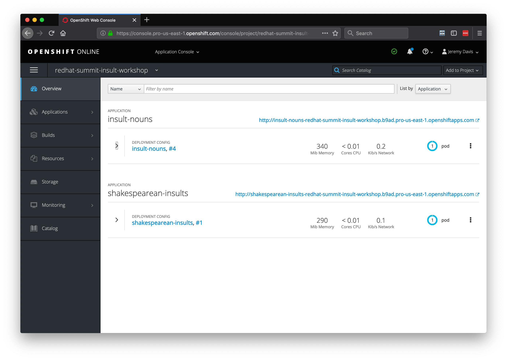

# Lab 5 Thorntail Insult Service

## First Steps

1. Import the app into VS Code
2. Update the starter app
3. Build
4. Deploy to OpenShift

### Import the app into VS Code

Open Visual Studio Code, choose "Open," and navigate to the root folder of the project

### Update the app

Our first step will be to customize the starter application.  Open the pom.xml and change lines 22 and 25 to be "shakespearean-insult" and "Shakespearean Insults" respectively:

```xml

20  <modelVersion>4.0.0</modelVersion>
21  <groupId>com.redhat.summit2019</groupId>
22  <artifactId>shakespearean-insults</artifactId>
23  <version>1.0.0</version>
24  <packaging>war</packaging>
25  <name>Shakespearean Insults</name>

``` 

The tests should all complete successfully, and you should see a success message.

  

### Deploying to OpenShift  

#### Building a Docker container for OpenShift

We will use the Fabric8 Maven Plugin to deploy our application to OpenShift.  The fabric8 plugin is already part of your pom.xml.  Check out lines 214-226:

```xml

          <plugin>
            <groupId>io.fabric8</groupId>
            <artifactId>fabric8-maven-plugin</artifactId>
            <executions>
              <execution>
                <id>fmp</id>
                <goals>
                  <goal>resource</goal>
                  <goal>build</goal>
                </goals>
              </execution>
            </executions>
          </plugin>

```

You can read more about the Fabric8 project here, http://fabric8.io/


#### Log in to OpenShift

You may still be logged into OpenShift.  You can check by running the following command:

```bash

oc whoami

```

If the response is your username then you are still logged in.  If you are still logged in you can skip the next step.

Fabric8 will build a Docker container and deploy it to OpenShift for us, but we need to be logged in first.  From your OpenShift console copy the login command by clicking on your name in the top right and choosing, "Copy Login Command."

  

Paste and enter the command into your terminal

  


#### Build and deploy to OpenShift

Now we can deploy our app.  From the terminal run the following maven command:

```bash

mvn clean fabric8:deploy -Popenshift  

```

This build will take longer because we are building Docker containers in addition to our Spring Boot application.  When the build and push to OpenShift is complete you will see a success message similar to the following:

```bash

[INFO] F8: HINT: Use the command `oc get pods -w` to watch your pods start up
[INFO] ------------------------------------------------------------------------
[INFO] BUILD SUCCESS
[INFO] ------------------------------------------------------------------------
[INFO] Total time:  06:40 min
[INFO] Finished at: 2019-04-24T12:49:12-04:00
[INFO] ------------------------------------------------------------------------

```

  

  

## Implement the Insult Microservice

We will take the same, test-driven approach to building the Insult Service that we did for the Adjective and Noun Services.

### Create and fail a JUnit Test for our endpoint

1. Create a new test class, InsultResourceTest.java, and enter the following content:

```java

package com.redhat.summit2019;

import org.jboss.arquillian.container.test.api.RunAsClient;
import org.jboss.arquillian.junit.Arquillian;
import org.junit.Assert;
import org.junit.Test;
import org.junit.runner.RunWith;
import org.wildfly.swarm.arquillian.DefaultDeployment;

import javax.ws.rs.client.Client;
import javax.ws.rs.client.ClientBuilder;
import javax.ws.rs.client.WebTarget;
import javax.ws.rs.core.MediaType;
import javax.ws.rs.core.Response;

@RunWith(Arquillian.class)
@DefaultDeployment
public class InsultResourceTest {

    @Test
    @RunAsClient
    public void serviceInvocation() {
        Client client = ClientBuilder.newClient();
        WebTarget target = client.target("http://localhost:8080")
                .path("api").path("noun");

        Response response = target.request(MediaType.APPLICATION_JSON).get();
        Assert.assertEquals(200, response.getStatus());
        Assert.assertNotNull(response.readEntity(String.class));
    }

}

```

Run the test either by Clicking the "Run Test" link in the IDE (just under the @Test annotation) or in the terminal with:

```bash

mvn clean test -Dtest=InsultResourceTest

```

Obviously our test should fail.  If for some reason it passes feel free to raise your hand and ask for help.

### Pass our JUnit test

#### Steps

1. Create an Insult domain model
2. Create an InsultResource to retrieve and return JSON


