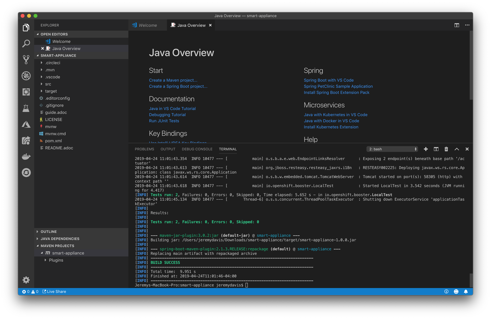
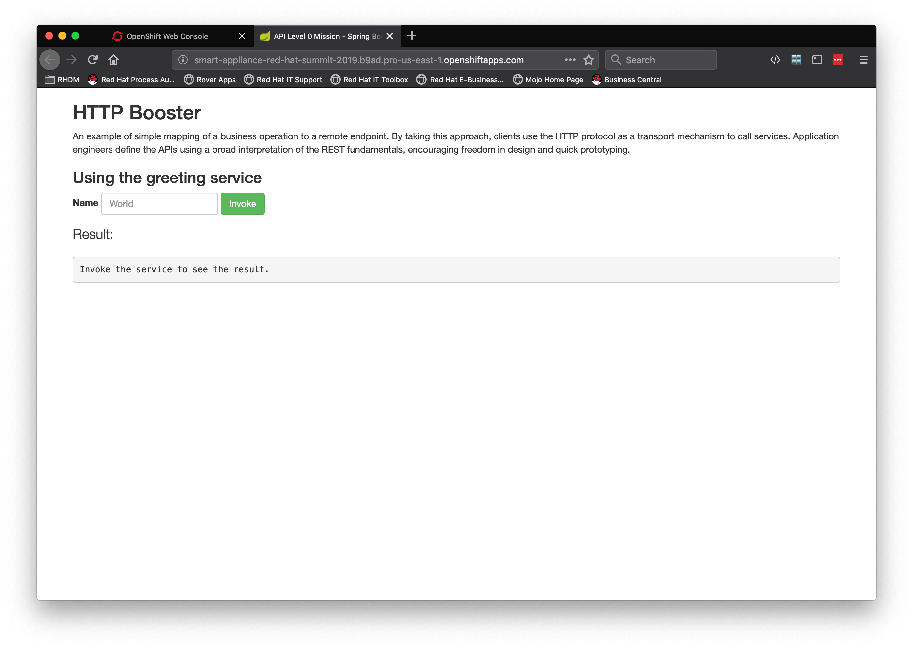

# Lab-9-Thorntail-Twitter_Service.md

## Create a Project for the Thorntail Twitter Service  
git clone https://github.com/jeremyrdavis/insult-starter-thorntail

## Create a Project for the Spring Boot Twitter Service  

###  Clone the repository 

If you've come this far you've probably figured out the first step by now

```bash

git clone https://github.com/jeremyrdavis/insult-starter-thorntail

```

### Or download the project zip file

You can download the zip file from Github by opening https://github.com/jeremyrdavis/insult-starter-thorntail
and choosing, "Download ZIP" from the green, "Clone or Download" button

  

### Import the app into VS Code

Open Visual Studio Code, choose "Open," and navigate to the root folder of the project

### Update the project settings

We need to update our project's settings from the default starter app to the adjective service we are building.

Open the pom.xml file and change the artifactId and name to 
"insult-tweets," and "Thorntail Insult Twitter Service":

```xml

  <artifactId>insults-twitter</artifactId>
  <version>1.0.0</version>
  
  ...
  
  <name>Thorntail Insult Twitter Service</name>

```

### Verify that the project builds

```bash

mvn clean package

```

The tests should all complete successfully, and you should see a success message.

  

  

### Verify that the project deploys to OpenShift  

We will use the Fabric8 Maven Plugin to deploy our application to OpenShift.  The fabric8 plugin is already part of your pom.xml.

```xml

          <plugin>
            <groupId>io.fabric8</groupId>
            <artifactId>fabric8-maven-plugin</artifactId>
            <executions>
              <execution>
                <id>fmp</id>
                <goals>
                  <goal>resource</goal>
                  <goal>build</goal>
                </goals>
              </execution>
            </executions>
          </plugin>

```

You can read more about the Fabric8 project here, http://fabric8.io/

#### Log in to OpenShift

You may still be logged into OpenShift.  You can check by running the following command:

```bash

oc whoami

```

If the response is your username then you are still logged in.  If you are still logged in you can skip the next step.

##### Log back in to OpenShift

Fabric8 will build a Docker container and deploy it to OpenShift for us, but we need to be logged in first.  From your OpenShift console copy the login command by clicking on your name in the top right and choosing, "Copy Login Command."

  

Paste and enter the command into your terminal

  


#### Build and deploy to OpenShift

Now we can deploy our app.  From the terminal run the following maven command:

```bash

mvn clean fabric8:deploy -Popenshift -DskipTests 

```

We have already run the tests so we will skip them to speed up the build

### Validating the deployment:  

1. Login to OpenShift Console - with your user name and password
2. Click on Project ‘red-hat-summit-2019’ if you are not already in that project
3. You should see 1 running pod and a url that you can access
4. Try the url


  


You should see:


  


## Get coding!

### Create and fail a JUnit Test for our endpoint

We are of course practicing TDD in this tutorial so our first step will be to write a Unit Test.  Create a new class, "TwitterResourceTest.java," in the "src/test/java/com/redhat/summit2019" directory with the following content:

```java

package com.redhat.summit2019;

import org.jboss.arquillian.container.test.api.RunAsClient;
import org.jboss.arquillian.junit.Arquillian;
import org.junit.Assert;
import org.junit.Test;
import org.junit.runner.RunWith;
import org.wildfly.swarm.arquillian.DefaultDeployment;

import static org.junit.Assume.assumeNoException;

import javax.ws.rs.client.Client;
import javax.ws.rs.client.ClientBuilder;
import javax.ws.rs.client.Entity;
import javax.ws.rs.client.WebTarget;
import javax.ws.rs.core.MediaType;
import javax.ws.rs.core.Response;

import com.redhat.summit2019.model.Insult;

@RunWith(Arquillian.class)
@DefaultDeployment
public class TwitterResourceTest {

    @Test
    @RunAsClient
    public void serviceInvocation() {
        Client client = ClientBuilder.newClient();
        WebTarget target = client.target("http://localhost:8080")
                .path("api").path("tweet");

        Insult insult = new Insult("Verily, ye be a goatish, mangled miscreant!");

        Response response = target.request(MediaType.APPLICATION_JSON).post(Entity.entity(insult, MediaType.APPLICATION_JSON));

        Assert.assertEquals(200, response.getStatus());
        Assert.assertNotNull(response.readEntity(String.class));
    }

}

```


1. Create a new class, "UpdateStatusTest.java," in the "src/test/java/com/redhat/summit2019" directory

Enter the following content:
